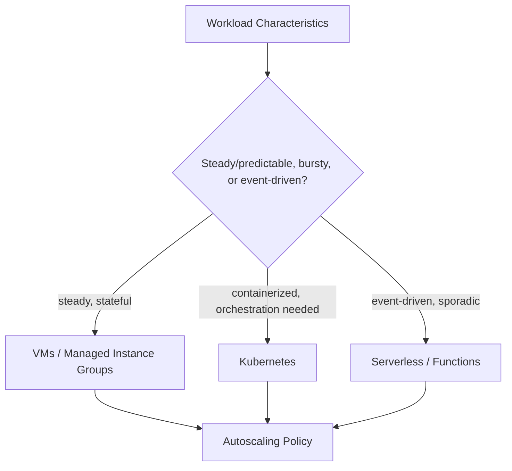

# Compute (Domain)

## Overview

Compute architecture is the set of decisions about where workloads run — VMs, containers, serverless functions — and how they scale, each with materially different cost, operational, and performance characteristics that should be matched deliberately to workload shape, not chosen by default habit.

## Business Problem

Defaulting to a single compute model organization-wide (e.g., "everything is a VM" or "everything is a container") wastes the opportunity to match workload characteristics — bursty vs. steady traffic, stateful vs. stateless, latency-sensitive vs. batch — to the compute model that actually fits best.

## Architecture

## Design Decisions

- **Compute model is chosen per-workload against actual traffic/state characteristics**, not standardized organization-wide by default — a steady-state stateful database backend and a sporadic webhook handler have genuinely different optimal compute models.
- **Autoscaling is configured against a meaningful metric** (request latency, queue depth) rather than defaulting to CPU utilization alone, which frequently doesn't correlate well with actual user-facing load for many workload types.
- **Right-sizing is a continuous practice**, not a one-time initial sizing exercise — see Cost Considerations.

## Decision Trade-offs

| Choice | Trade-off |
|---|---|
| VMs/managed instance groups | Full control, predictable performance for steady workloads; more operational overhead (patching, image management) than serverless |
| Kubernetes | Strong workload portability and bin-packing efficiency for many services; real platform operational overhead (see `architecture-domains/kubernetes.md`) |
| Serverless/functions | Scales to zero, minimal operational overhead; cold-start latency and per-invocation cost model can be a poor fit for steady, high-throughput workloads |

## Advantages

- Matching compute model to workload shape optimizes both cost and operational overhead simultaneously
- Meaningful-metric autoscaling responds to actual user impact rather than a proxy metric that may not correlate well
- Continuous right-sizing catches the natural drift between initial capacity planning and actual production behavior

## Disadvantages

- Supporting multiple compute models organization-wide (VMs, Kubernetes, serverless) multiplies the platform team's operational surface area versus standardizing on one
- Autoscaling on a custom metric requires more setup than defaulting to CPU, and a poorly chosen metric can be worse than the CPU default
- Continuous right-sizing requires ongoing attention that's easy to deprioritize once initial capacity planning is "done"

## Security Considerations

Compute images/containers should be built from a hardened, centrally maintained base rather than each team independently sourcing base images — reducing the attack surface from outdated or unpatched dependencies across the fleet.

## Operational Considerations

Supporting multiple compute models has a real platform-team cost — see `architecture-domains/platform-engineering.md` for why a golden-path catalog (a small number of well-supported compute patterns, not unlimited choice) is usually the right balance.

## Cost Considerations

Compute is frequently the largest single cost line item in a cloud bill, and over-provisioning (sizing for peak load that rarely occurs, or never scaling down) is the most common, most fixable source of waste — automated right-sizing recommendations and scheduled scale-down for non-production environments are high-leverage cost controls.

## Scalability

Each compute model has a different natural scaling ceiling and characteristic — serverless scales to zero and up rapidly but has per-invocation limits; Kubernetes scales well horizontally but requires cluster capacity planning; VMs scale via managed instance groups but with slower cold-start than serverless.

## Availability

Compute availability depends on both the compute model's own resilience characteristics (multi-zone instance groups, pod disruption budgets) and the autoscaling policy's ability to respond to load before user-facing degradation occurs — see `architecture-domains/disaster-recovery.md`.

## Real Enterprise Scenario

A retail company moved their highly seasonal, bursty order-processing webhook handlers from a steadily-running VM fleet (sized for Black Friday peak, mostly idle the rest of the year) to serverless functions, cutting compute cost for that workload by roughly 70% while improving their ability to absorb genuinely unpredictable traffic spikes without manual capacity planning.

## Common Mistakes

- Standardizing on a single compute model organization-wide regardless of workload fit, missing significant cost and operational optimization opportunities.
- Autoscaling on CPU utilization by default without checking whether it actually correlates with user-facing load for that specific workload.
- Sizing compute once at launch and never revisiting, missing the natural drift between initial estimates and actual production behavior.

## Interview Questions

- "How do you decide between VMs, Kubernetes, and serverless for a new workload?"
- "What metric would you autoscale a request-heavy API on, and why not just CPU?"
- "How do you approach ongoing compute right-sizing at an organizational level?"

## Summary

Compute architecture matches workload characteristics — steady versus bursty, stateful versus stateless — to the appropriate model (VMs, Kubernetes, serverless), with meaningful-metric autoscaling and continuous right-sizing as the two most commonly underinvested practices relative to their cost impact.

## Further Reading

- `architecture-domains/kubernetes.md`
- `best-practices/migration-considerations.md`
