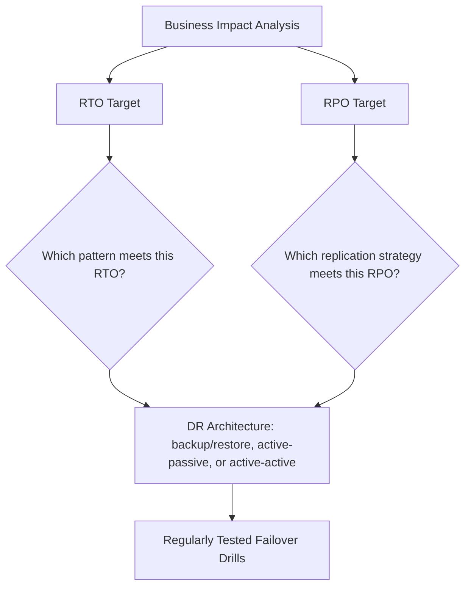

# Disaster Recovery (Domain)

## Overview

Disaster recovery architecture is driven entirely by two numbers, decided in advance and per-workload: Recovery Time Objective (RTO, how long can this be down) and Recovery Point Objective (RPO, how much data can be lost). Every other DR design decision follows from these two targets, not the reverse.

## Business Problem

Without explicit RTO/RPO targets, disaster recovery design defaults either to "as resilient as possible" (expensive, often unjustified) or "whatever we happened to build" (inadequate, discovered only during an actual incident) — neither is a deliberate engineering decision.

## Architecture

## Design Decisions

- **RTO/RPO targets are set per-workload, by business stakeholders, before any technical design begins** — a marketing website and a payments ledger have legitimately different targets, and applying one DR strategy uniformly wastes resources on the former or under-protects the latter.
- **Backup/restore, active-passive, and active-active are a spectrum of increasing cost and decreasing RTO/RPO**, not competing options to choose arbitrarily — see `cloud-patterns/active-active.md` and `cloud-patterns/active-passive.md` for when each is justified.
- **Failover is regularly drilled**, not just documented — an untested DR plan is a hypothesis, not a plan, and this repository treats scheduled drills as a non-negotiable part of the DR architecture itself, not an optional extra.

## Decision Trade-offs

| Choice | Trade-off |
|---|---|
| Backup/restore only | Lowest cost; RTO measured in hours-to-days depending on restore time and infrastructure rebuild |
| Active-passive (warm standby) | Moderate cost, RTO in minutes; standby capacity is mostly idle under normal operation |
| Active-active | Highest cost, RTO near-zero; requires solving multi-writer data consistency |

## Advantages

- RTO/RPO-driven design ensures DR investment is proportional to actual business impact, not applied uniformly
- Regular drills catch gaps (stale runbooks, DNS TTL issues, forgotten manual steps) before they matter in a real incident
- A tiered spectrum of DR patterns lets different workloads within the same organization get appropriately different levels of investment

## Disadvantages

- Setting genuinely meaningful RTO/RPO targets requires real business stakeholder engagement, which is often harder to secure than the technical design itself
- Regular drills have real operational cost and, if done against production, real risk — needs careful design to drill safely
- The temptation to skip explicit RTO/RPO and just "build something resilient" is strong under time pressure, and produces designs that are hard to evaluate against any actual requirement

## Security Considerations

DR infrastructure (backups, standby environments) needs the same security posture as production at all times — a backup store or standby environment with weaker security is a liability, both as an attack target and because it becomes production the moment it's needed.

## Operational Considerations

DR runbooks should be tested by someone other than their author, ideally someone unfamiliar with the system — this surfaces gaps a runbook's author, who carries implicit context, would never notice.

## Cost Considerations

DR cost scales roughly with how aggressive the RTO/RPO target is — the cost curve from backup/restore to active-passive to active-active is steep, which is exactly why setting the target deliberately (rather than defaulting to the most resilient option) matters for cost discipline.

## Scalability

DR patterns compose with multi-region architecture (`cloud-patterns/multi-region.md`) — as an organization scales into more regions and workloads, DR strategy should scale in sophistication proportionally, not remain fixed at whatever was adequate for a smaller estate.

## Availability

This entire domain is fundamentally about availability under failure conditions — see `cloud-patterns/active-active.md` and `cloud-patterns/active-passive.md` for the specific patterns.

## Real Enterprise Scenario

A healthcare company's disaster recovery drill for their patient records system revealed that their documented failover runbook referenced a DNS record that had been migrated to a different provider eight months earlier and never updated — a gap that would have added an estimated 45 minutes to a real failover, discovered safely during a drill instead of during an actual regional outage.

## Common Mistakes

- Building DR infrastructure without ever setting explicit RTO/RPO targets, making it impossible to evaluate whether the design actually meets business needs.
- Documenting a failover runbook once and never drilling it, allowing it to silently go stale.
- Applying the same DR pattern (typically whichever is most familiar) to every workload regardless of actual business criticality.

## Interview Questions

- "How do you determine RTO and RPO for a new workload?"
- "Walk me through how you'd design and safely execute a failover drill."
- "How do backup/restore, active-passive, and active-active differ in terms of cost and recovery characteristics?"

## Summary

Disaster recovery architecture starts with explicit, business-stakeholder-set RTO/RPO targets per workload, chooses a pattern (backup/restore, active-passive, active-active) proportional to those targets, and treats regular failover drills as a core part of the architecture, not an optional extra.

## Further Reading

- `cloud-patterns/active-active.md`, `cloud-patterns/active-passive.md`, `cloud-patterns/multi-region.md`
- Companion repository: `gcp-landing-zone`, `docs/11-disaster-recovery.md`
