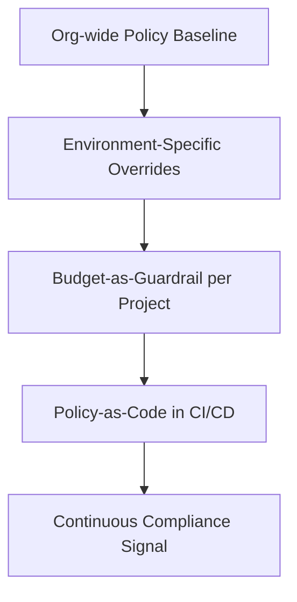

# Governance (Domain)

## Overview

Governance is the set of automated guardrails — policy constraints, budget controls, tagging standards, and policy-as-code checks — that keep a cloud estate consistent and compliant as it scales past what any individual architect can manually review.

## Business Problem

Without structural governance, consistency depends on every engineer remembering and following every convention correctly, every time — a strategy that reliably fails at scale, producing inconsistent naming, ungoverned spend, and compliance gaps discovered only during external audits.

## Architecture

## Design Decisions

- **Policy inheritance with environment-specific overrides** — a conservative organization-wide baseline, tightened further in production, deliberately relaxed (with compensating controls) in sandbox — see the companion `gcp-landing-zone` repository's `docs/08-governance.md`.
- **Budget as a structural guardrail**, not just a dashboard — every project gets a budget with alert thresholds at creation time, not retroactively.
- **Policy-as-code in CI**, not policy-as-documentation — see `architecture-domains/security.md` and the companion `terraform-enterprise` repository's `docs/08-policy-as-code.md` for OPA/Sentinel enforcement against Terraform plans before apply.

## Decision Trade-offs

| Choice | Trade-off |
|---|---|
| Structural governance (policy-as-code, org policy) | Consistent enforcement at scale without proportional review-team growth; requires real upfront tooling investment |
| Procedural governance (manual review, checklists) | Lower upfront tooling cost; reliably degrades at scale as review volume outpaces reviewer capacity |

## Advantages

- Catches violations automatically, before deployment, rather than during a compliance audit months later
- Scales without requiring a proportionally larger governance/review team as the organization grows
- Creates a consistent, traceable record of policy decisions and exceptions

## Disadvantages

- Requires genuine upfront tooling investment (policy engines, CI integration) before the payoff is realized
- Overly strict governance applied uniformly can suppress legitimate experimentation, particularly in early-stage/sandbox contexts
- Policy exceptions need active tracking, or governance quietly erodes through undocumented overrides

## Security Considerations

Governance and security are closely related but distinct — governance answers "is this structurally allowed," security answers "is this specific identity allowed to do this specific thing right now." See `architecture-domains/security.md` for the distinction in practice.

## Operational Considerations

Every governance exception (a relaxed policy constraint for a specific project) should be tracked, time-boxed where possible, and reviewed periodically — untracked exceptions are functionally the same as no policy at all.

## Cost Considerations

Budget-as-guardrail is governance's most directly cost-relevant mechanism — projects with alert thresholds set at creation catch runaway spend early, versus discovering it in a monthly bill review.

## Scalability

Structural, policy-as-code governance scales far better than manual review as an organization grows — this is the central argument for investing in it before the organization is large enough to feel manual review's limits acutely.

## Availability

Not directly applicable to this document; see `architecture-domains/disaster-recovery.md`.

## Real Enterprise Scenario

A manufacturing company's finance team discovered a six-figure monthly overspend in a sandbox environment, accumulated over several months, because no budget alert had been configured at project creation. Retrofitting budget-as-guardrail into the project factory pattern (see the companion `gcp-landing-zone` repository's `docs/04-project-strategy.md`) eliminated this failure mode going forward.

## Common Mistakes

- Treating governance as a one-time compliance project instead of an evolving, continuously enforced set of controls.
- Applying identical, strict policy uniformly across production and sandbox, suppressing legitimate experimentation.
- Setting budget alerts as informational only, with no owner responsible for acting on a breach.

## Interview Questions

- "How would you design governance that scales without a proportionally larger review team?"
- "What's the difference between governance and security, in your framing?"
- "How do you handle legitimate policy exceptions without eroding governance overall?"

## Summary

Governance combines policy inheritance (with deliberate environment-specific relaxation), budget-as-guardrail, and policy-as-code enforcement in CI to keep a cloud estate consistent and compliant at scale — structurally, not through reliance on manual review capacity that doesn't scale with organizational growth.

## Further Reading

- Companion repository: `gcp-landing-zone`, `docs/08-governance.md`; `terraform-enterprise`, `docs/08-policy-as-code.md`
- `best-practices/governance-checklist.md`
