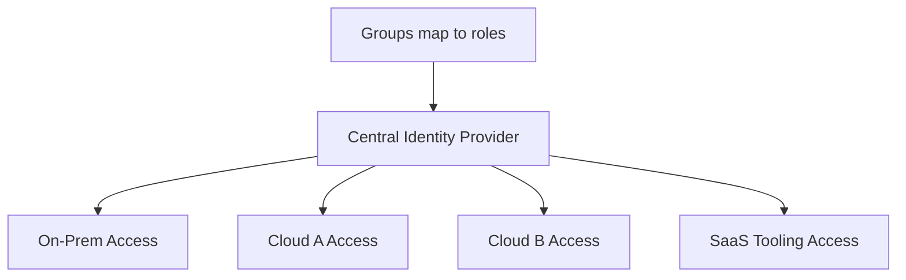

# Identity (Domain)

## Overview

Identity is the foundation every other access control decision builds on — networking segmentation, IAM, Zero Trust policy, and audit logging are all ultimately anchored to "who (or what) is making this request." This domain covers identity federation, access models, and the group-based IAM pattern used throughout this repository.

## Business Problem

Fragmented identity — separate credentials for on-prem, each cloud, and each SaaS tool — multiplies attack surface (more credentials to phish or leak), makes offboarding error-prone (an employee's access might live in a dozen disconnected systems), and makes any coherent access review nearly impossible.

## Architecture

## Design Decisions

- **Group-based access, never individual bindings** — see the companion `gcp-landing-zone` repository's `docs/07-iam-security.md` for the concrete pattern: every IAM binding targets a group, offboarding is one action (remove from group), and access reviews mean reviewing group membership, not hundreds of individual bindings.
- **Federated identity, single source of truth** — one identity provider federates access to on-prem, every cloud, and SaaS tooling, rather than maintaining separate, unsynchronized identity stores per system.
- **Custom, least-privilege roles over broad predefined roles** for workload access — broad roles like Owner/Editor are reserved for a small, tightly controlled platform tier.

## Decision Trade-offs

| Choice | Trade-off |
|---|---|
| Group-based IAM | Clean, auditable access model; requires disciplined identity provider group hygiene to avoid stale or overly broad groups |
| Federated single identity provider | Consistent access model and single offboarding action; the identity provider becomes a critical, must-be-highly-available dependency |
| Custom least-privilege roles | Strong least-privilege posture; more roles to define and maintain than defaulting to predefined roles |

## Advantages

- Offboarding is atomic and reliable — remove from group, access is revoked everywhere at once
- Access reviews become tractable — reviewing group membership scales far better than reviewing individual bindings
- A single identity provider gives security teams one place to detect anomalous authentication activity

## Disadvantages

- Group sprawl (too many overly specific groups) can recreate the same audit complexity individual bindings would have caused
- Federating identity to every system is real integration work, and legacy on-prem systems sometimes resist clean federation
- The identity provider's availability becomes critical-path for access to everything — an outage here has organization-wide impact

## Security Considerations

Identity is the primary control surface in architectures with intentionally porous network perimeters (Shared VPC, Zero Trust) — see `cloud-patterns/zero-trust.md`. Privilege escalation paths (e.g., a role including `iam.serviceAccounts.actAs` or its Azure equivalent) must be treated as equivalent to whatever that downstream identity can do.

## Operational Considerations

Quarterly (minimum) access reviews comparing group membership against actual team rosters catch drift before it becomes a finding in an external audit — this should be a scheduled, owned operational process, not an ad hoc activity.

## Cost Considerations

Identity provider licensing is usually a modest cost relative to the risk it mitigates; the larger, less visible cost is the engineering time to properly federate every system — often underestimated in project planning.

## Scalability

Group-based, federated identity scales cleanly from dozens to tens of thousands of identities without a change in model — only the group taxonomy and role catalog need ongoing curation as the organization grows.

## Availability

The identity provider's availability directly bounds the availability of everything depending on it for access — this argues for treating identity infrastructure with Tier-0 operational rigor, including its own disaster recovery plan.

## Real Enterprise Scenario

A financial services company's security audit flagged 40+ individual IAM bindings to former employees across various cloud projects — access that had never been cleanly revoked because it was granted ad hoc rather than through group membership. Migrating to group-based access and instituting quarterly reviews eliminated the finding category entirely within two quarters.

## Common Mistakes

- Binding IAM roles to individual users because it's faster than updating a group, creating invisible access that outlives the person's role.
- Allowing group sprawl — dozens of overly specific, overlapping groups that are as hard to audit as individual bindings.
- Treating identity federation as optional for legacy on-prem systems, leaving a permanent gap in the unified access model.

## Interview Questions

- "How would you design an offboarding process that's reliable across a dozen different systems?"
- "What's your approach to periodic access reviews at scale?"
- "How do you decide between a predefined and a custom IAM role?"

## Summary

Identity architecture centers on group-based, least-privilege IAM bindings and a single, federated identity provider spanning on-prem, cloud, and SaaS — trading upfront integration effort and identity-provider criticality for dramatically more tractable offboarding and access review at scale.

## Further Reading

- Companion repository: `gcp-landing-zone`, `docs/07-iam-security.md`
- `cloud-patterns/zero-trust.md`
- `architecture-decision-records/adr-003-identity.md`
