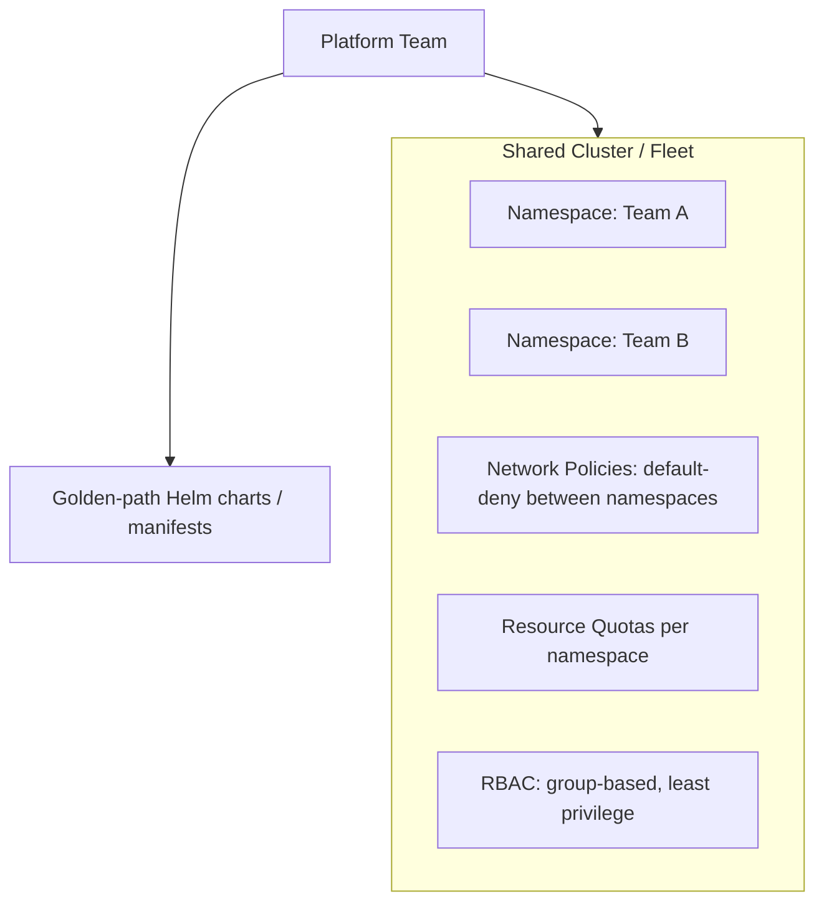

# Kubernetes (Domain)

## Overview

Kubernetes architecture at enterprise scale is less about running containers and more about multi-tenancy, platform boundaries, and how a shared cluster (or fleet of clusters) is governed across many teams with different trust levels and workload characteristics.

## Business Problem

A single, ungoverned Kubernetes cluster shared across many teams accumulates the same governance problems as an ungoverned cloud estate — inconsistent resource requests causing noisy-neighbor issues, inconsistent RBAC, and no clean tenant isolation boundary — but at a faster pace, because Kubernetes makes it easy to deploy quickly without those guardrails in place.

## Architecture

## Design Decisions

- **Tenant isolation boundary is a deliberate choice, not a default** — namespace-based isolation (cheaper, less isolation) versus per-tenant clusters (more isolation, more overhead) is decided against actual compliance and blast-radius requirements, not defaulted uniformly. See `architecture-decision-records/adr-004-kubernetes.md`.
- **Network policies default-deny between namespaces**, mirroring the hierarchical firewall policy pattern at the network layer (`architecture-domains/networking.md`) — cross-namespace traffic is explicit, not ambient.
- **RBAC is group-based**, consistent with the identity model in `architecture-domains/identity.md` — no individual user bindings to cluster roles.
- **Resource quotas and limit ranges per namespace** prevent any single team from starving the shared cluster's capacity — a "noisy neighbor" control essential to any shared-cluster multi-tenancy model.

## Decision Trade-offs

| Choice | Trade-off |
|---|---|
| Namespace-based multi-tenancy | Lower operational overhead, higher cluster utilization; weaker isolation than per-tenant clusters (shared control plane, shared node pools unless explicitly segmented) |
| Per-tenant clusters | Strongest isolation (separate control planes); significantly higher operational and cost overhead, harder to justify below a certain compliance bar |

## Advantages

- Namespace-based multi-tenancy achieves good resource utilization and lower operational overhead for teams without strict regulatory isolation requirements
- Default-deny network policy plus group-based RBAC gives a consistent, auditable security posture across every tenant
- A golden-path Helm chart/manifest catalog (see `architecture-domains/platform-engineering.md`) lets teams deploy safely without hand-writing raw Kubernetes YAML each time

## Disadvantages

- Namespace isolation is genuinely weaker than cluster-level isolation — a container escape or node-level compromise can affect every tenant sharing that node pool
- Multi-tenant clusters require constant vigilance against resource quota gaps and RBAC drift, both of which degrade the isolation model silently over time
- Cluster upgrades affect every tenant simultaneously, requiring careful coordination that per-tenant clusters would avoid

## Security Considerations

Kubernetes RBAC and network policy are necessary but not sufficient — see `cloud-patterns/mesh-network.md` for how a service mesh's identity-based mTLS adds a layer network policy alone can't provide, particularly for workloads processing sensitive data.

## Operational Considerations

Cluster upgrades, node pool management, and add-on lifecycle (ingress controllers, service mesh control planes) are platform-team-owned responsibilities requiring their own on-call rigor — see `architecture-domains/platform-engineering.md`.

## Cost Considerations

Shared clusters generally achieve better bin-packing/utilization than per-tenant clusters, but require accurate per-namespace cost attribution (via resource quotas and labels) to avoid the shared-cost-allocation problem common in any shared-infrastructure model.

## Scalability

A well-governed shared-cluster model scales to dozens of tenant teams; beyond a certain scale or compliance threshold, a fleet of purpose-segmented clusters (e.g., regulated-workload clusters separate from general-purpose ones) is a common intermediate step before full per-tenant isolation.

## Availability

Cluster-level availability (multi-zone node pools, properly configured pod disruption budgets) protects every tenant simultaneously — see `architecture-domains/disaster-recovery.md` for how this composes with multi-region Kubernetes patterns.

## Real Enterprise Scenario

A financial services company initially ran all workloads in namespace-isolated shared clusters, then migrated their PCI-DSS-scoped payments workloads to a dedicated cluster after a compliance audit required node-level isolation evidence that namespace isolation alone couldn't provide — illustrating the isolation-boundary decision as genuinely workload-dependent, not universal. See `case-studies/kubernetes-adoption.md`.

## Common Mistakes

- Defaulting to namespace isolation for every workload without evaluating whether specific tenants' compliance requirements actually demand cluster-level isolation.
- Missing or inconsistent resource quotas, allowing a single misbehaving workload to degrade the shared cluster for every tenant.
- RBAC bound to individual users instead of groups, recreating the same offboarding and audit problems described in `architecture-domains/identity.md`.

## Interview Questions

- "How do you decide between namespace-based and cluster-based multi-tenancy for a given workload?"
- "Walk me through your default network policy model for a shared cluster."
- "How would you handle a compliance requirement for node-level isolation within an existing shared-cluster fleet?"

## Summary

Enterprise Kubernetes architecture is fundamentally a multi-tenancy governance problem — namespace isolation, default-deny network policy, group-based RBAC, and resource quotas provide a workable shared-cluster model, with cluster-level isolation reserved for workloads whose compliance requirements genuinely demand it.

## Further Reading

- `architecture-decision-records/adr-004-kubernetes.md`
- `reference-architectures/kubernetes-platform.md`
- `case-studies/kubernetes-adoption.md`
- `diagrams/kubernetes.drawio`
