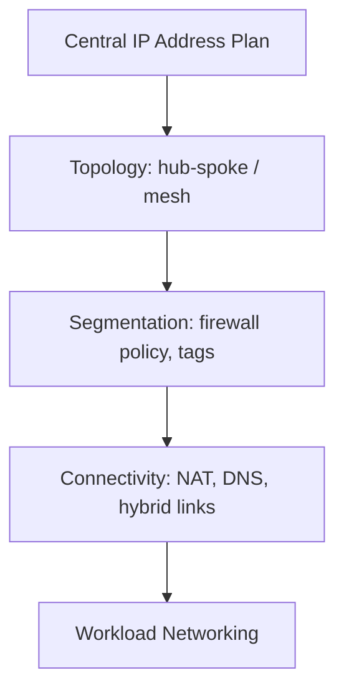

# Networking (Domain)

## Overview

Networking is the connective tissue of every cloud architecture — how workloads reach each other, reach the internet, and reach on-prem systems, and how traffic is segmented and inspected along the way. This domain deep-dive covers the reasoning that underlies the topology patterns in `cloud-patterns/`.

## Business Problem

Networking decisions are among the most expensive to change after the fact — IP address plans, topology choices, and segmentation models get built into every downstream workload's assumptions. Getting the foundational network architecture right early avoids costly, disruptive re-architecture later.

## Architecture

## Design Decisions

- **Centralized IP address planning precedes everything else** — every subnet, every peering relationship, and every hybrid connection depends on non-overlapping address space decided once, centrally.
- **Default-deny segmentation** — see the hierarchical firewall policy model in the companion `gcp-landing-zone` repository's `docs/06-networking.md` — traffic is denied by default and explicitly allowed, not the reverse.
- Hub-and-spoke (`cloud-patterns/hub-spoke.md`) is the default topology; mesh/service-mesh (`cloud-patterns/mesh-network.md`) is adopted for specific workload-to-workload communication needs, not as the default.

## Decision Trade-offs

| Choice | Trade-off |
|---|---|
| Centralized IP planning | Prevents costly overlap/renumbering later; requires upfront coordination across teams that may resist the process |
| Default-deny segmentation | Strong baseline security posture; requires active allow-rule management, more operational overhead than default-allow |

## Advantages

- A well-planned network foundation avoids the most expensive category of "we have to redesign this" cloud architecture mistakes
- Centralized segmentation policy (hierarchical firewall policy) gives security teams a single, auditable enforcement point
- Consistent DNS and NAT patterns reduce operational surprises across teams

## Disadvantages

- Centralized network governance can become a bottleneck if the platform team doesn't invest in self-service subnet/firewall-exception provisioning
- Default-deny requires more active management than default-allow, and a missing allow rule is a common source of "why can't my service reach X" support tickets

## Security Considerations

Networking segmentation is one layer of defense-in-depth, not a substitute for identity-based access control — see `cloud-patterns/zero-trust.md` for why "on the internal network" should never be the sole basis for trust.

## Operational Considerations

Network changes (firewall rules, routing) should flow through the same reviewed, auditable Terraform pipeline as any other infrastructure change — manual console-based network changes are a common source of untracked drift and security gaps.

## Cost Considerations

NAT gateway data processing charges, cross-region/cross-zone data transfer, and Interconnect/VPN circuit costs are the primary network cost drivers at scale — often underestimated relative to compute/storage costs in initial budgeting.

## Scalability

A centrally IP-planned, hub-and-spoke network scales to hundreds of workload teams without redesign — see `cloud-patterns/hub-spoke.md` and `cloud-patterns/shared-services.md`.

## Availability

Network component redundancy (multi-zone NAT, redundant hybrid connectivity) is essential — a single-zone network dependency is a common, avoidable single point of failure. See `architecture-domains/disaster-recovery.md`.

## Real Enterprise Scenario

A retail company's networking team discovered, mid-acquisition-integration, that the acquired company's cloud estate used an overlapping IP range with their own — a direct consequence of the acquired company never having established centralized IP planning. The resulting renumbering effort delayed the integration by several months, a clear illustration of why this document treats IP planning as a foundational, non-negotiable first step.

## Common Mistakes

- Allowing teams to self-select subnet ranges without central coordination, leading to overlap discovered only during peering or M&A integration.
- Defaulting to broad allow-all firewall rules "to unblock" a team, then never tightening them.
- Under-provisioning NAT/hybrid connectivity redundancy relative to how many workloads depend on it.

## Interview Questions

- "How would you plan IP address space for an organization expecting to grow through acquisition?"
- "Walk me through your default network segmentation model."
- "How do you balance default-deny security with developer velocity?"

## Summary

Networking architecture starts with centralized IP address planning, defaults to hub-and-spoke topology with default-deny segmentation, and treats hybrid/NAT connectivity redundancy as essential rather than optional — foundational decisions that are expensive to unwind later.

## Further Reading

- `cloud-patterns/hub-spoke.md`, `cloud-patterns/mesh-network.md`, `cloud-patterns/zero-trust.md`
- Companion repository: `gcp-landing-zone`, `docs/06-networking.md`
