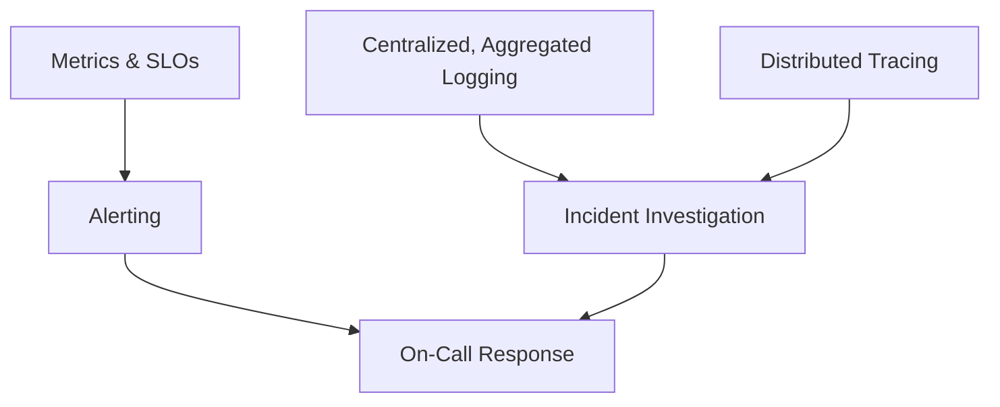

# Observability (Domain)

## Overview

Observability is the ability to understand a system's internal state from its external outputs — logs, metrics, and traces — well enough to diagnose novel problems, not just the ones anticipated in advance. This distinguishes it from traditional monitoring, which typically only answers pre-defined questions.

## Business Problem

Systems fail in ways nobody anticipated — that's the nature of failure. A monitoring setup that only surfaces pre-built dashboards for known failure modes leaves teams blind exactly when a genuinely novel incident occurs, which is when observability matters most.

## Architecture

## Design Decisions

- **Centralized, org-wide aggregated logging** — every project's logs flow into one place, not siloed per-project stores, so an investigation spanning multiple projects doesn't require querying each independently. See the companion `gcp-landing-zone` repository's `docs/09-monitoring-logging.md`.
- **SLOs, not just uptime metrics** — service level objectives tied to actual user-facing experience (latency, error rate) drive alerting, rather than infrastructure-level metrics alone that may not correlate with user impact.
- **Alert on control-plane changes with the highest severity** — IAM and policy changes are leading indicators worth surfacing immediately, not buried among routine operational alerts.

## Decision Trade-offs

| Choice | Trade-off |
|---|---|
| Centralized aggregated logging | Single place to investigate cross-project incidents; the aggregation destination becomes a high-value target requiring extra security hardening |
| SLO-based alerting | Alerts correlate with actual user impact, reducing noise; requires defining and maintaining meaningful SLOs per service, which is real ongoing work |

## Advantages

- Dramatically shortens investigation time for incidents spanning multiple services or projects
- SLO-based alerting reduces alert fatigue by focusing on user-impacting signal rather than every infrastructure metric fluctuation
- Distributed tracing makes latency and error attribution in microservice architectures tractable, where log correlation alone would be exceedingly difficult

## Disadvantages

- Centralized logging has real cost at scale (ingestion, storage, query) that needs active retention/tiering management
- SLOs require genuine ongoing maintenance — stale SLOs that no longer reflect actual user experience are worse than no SLOs, because they create false confidence
- Distributed tracing requires instrumentation discipline across every service — partial adoption produces confusing, incomplete traces

## Security Considerations

The centralized logging destination is as sensitive as the data it contains and should be access-restricted accordingly — see `architecture-domains/security.md` and `architecture-domains/governance.md`.

## Operational Considerations

Log retention should be tiered — recent, hot data in a fast-queryable store; older data moved to cold, cheap storage for compliance retention — see the hot/cold split pattern in the companion `gcp-landing-zone` repository.

## Cost Considerations

Observability tooling cost scales with data volume, which can grow faster than infrastructure cost itself in verbose or high-traffic systems — sampling strategies for traces and log-level tuning are common, necessary cost controls.

## Scalability

Centralized observability scales well when built on aggregation and tiered retention from the start; retrofitting aggregation onto dozens of siloed per-project log stores is a much harder migration.

## Availability

Observability tooling itself needs to be highly available — an outage in the monitoring/alerting pipeline during an actual incident compounds the problem by blinding the response team exactly when visibility matters most.

## Real Enterprise Scenario

A media company's on-call engineer diagnosed a cross-service latency regression within 20 minutes using distributed tracing, tracing a single slow database query's impact across six downstream services — a diagnosis that would have taken hours of manual log correlation across six separate services without tracing infrastructure in place.

## Common Mistakes

- Building dashboards only for anticipated failure modes, leaving the team blind to genuinely novel incidents.
- Alerting on infrastructure metrics (CPU, memory) that don't reliably correlate with actual user-facing impact, causing alert fatigue.
- Partial tracing instrumentation that produces confusing, broken traces instead of genuinely useful ones.

## Interview Questions

- "What's the difference between monitoring and observability, in your view?"
- "How do you define a meaningful SLO for a new service?"
- "Walk me through how you'd diagnose a cross-service latency issue."

## Summary

Observability combines centralized, aggregated logging, SLO-driven alerting, and distributed tracing to make novel, unanticipated failures diagnosable — not just the failure modes a team thought to build dashboards for in advance.

## Further Reading

- Companion repository: `gcp-landing-zone`, `docs/09-monitoring-logging.md`
- `architecture-domains/disaster-recovery.md`
