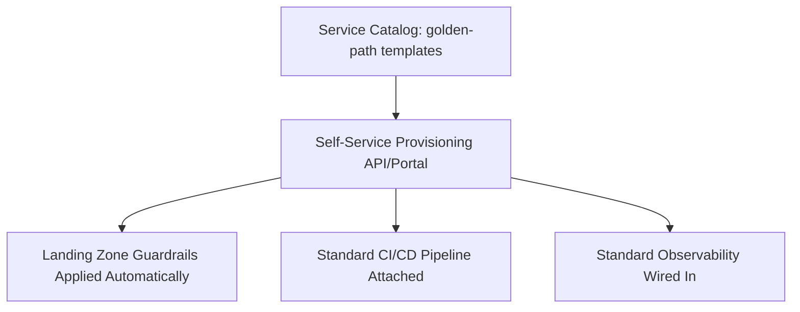

# Platform Engineering (Domain)

## Overview

This domain deep-dive covers the technical architecture of an internal developer platform — golden-path templates, self-service provisioning, and the platform APIs that make infrastructure consumable without a ticket queue. See `architecture-principles/platform-engineering.md` for the underlying product-management principle.

## Business Problem

Every application team independently solving CI/CD, observability wiring, and infrastructure provisioning produces wildly inconsistent quality and wastes the organization's most capable infrastructure engineers on repetitive, low-leverage support work instead of building genuinely reusable capability.

## Architecture

## Design Decisions

- A **service catalog of golden-path templates** (a new service scaffolded with CI/CD, observability, and landing zone guardrails already wired in) is the platform's primary interface — not a menu of individually requestable infrastructure primitives.
- **Self-service provisioning**, backed by the same Terraform modules described in the companion `terraform-enterprise` repository, so a new service is created through a reviewed pipeline, not a ticket to the platform team.
- **Escape hatches are supported, not blocked** — a team that needs to deviate from the golden path can, but does so visibly (a documented exception), preserving the platform's ability to reason about what's actually running.

## Decision Trade-offs

| Choice | Trade-off |
|---|---|
| Golden-path service catalog | High consistency and fast onboarding for the common case; requires ongoing platform investment to keep templates current and genuinely good |
| Self-service over ticket-based provisioning | Removes the platform team as a bottleneck; requires more upfront engineering to build safe, reviewable self-service tooling |

## Advantages

- New services inherit consistent security, observability, and CI/CD posture automatically
- Frees the platform team from repetitive per-team provisioning requests
- Escape hatches keep the platform from becoming an obstacle for genuinely unusual requirements

## Disadvantages

- Golden-path templates require ongoing maintenance investment or they become stale and get bypassed
- Self-service tooling has real upfront engineering cost before the payoff is realized
- Balancing opinionation (a genuinely good default) against flexibility (supporting real edge cases) is an ongoing design tension, not a one-time decision

## Security Considerations

Baking security defaults (least-privilege IAM, secret management wiring, network segmentation) into the golden path is one of the highest-leverage security investments available — every team gets them by default without relying on individual engineers making the right call each time.

## Operational Considerations

The platform team needs on-call rotations and SLOs for the platform itself — see `architecture-principles/platform-engineering.md` — since a platform outage blocks every consuming team simultaneously.

## Cost Considerations

Platform investment has a strong ROI case but a delayed payoff curve — the business case usually needs to be made in terms of engineering time saved across every consuming team over time, not immediate cost reduction.

## Scalability

Platform leverage increases with the number of consuming teams — this domain's investment case gets stronger, not weaker, as the organization scales.

## Availability

Platform availability directly bounds every consuming team's ability to ship — treat platform SLOs with the same rigor as any customer-facing service's SLOs.

## Real Enterprise Scenario

See `case-studies/kubernetes-adoption.md` for a complete narrative of a platform engineering initiative — including the adoption curve challenges and how office-hours support alongside the self-service tooling itself proved necessary to drive real adoption.

## Common Mistakes

- Building a comprehensive self-service platform without validating it against real team workflows first, producing something technically complete but not actually used.
- No escape hatches, forcing teams into workarounds that undermine the platform's visibility into what's actually deployed.
- Under-resourcing platform on-call, treating platform outages as lower priority than customer-facing service outages despite blocking every team simultaneously.

## Interview Questions

- "How would you design a service catalog's first three golden-path templates?"
- "How do you decide what belongs in the golden path versus what's left to individual teams?"
- "How do you measure whether your platform is actually reducing toil?"

## Summary

Platform engineering's technical architecture centers on a self-service golden-path catalog with landing zone guardrails, CI/CD, and observability wired in by default — with deliberate, visible escape hatches — reducing repetitive per-team infrastructure work while preserving the platform's ability to reason about what's running.

## Further Reading

- `architecture-principles/platform-engineering.md`
- `reference-architectures/kubernetes-platform.md`
- `case-studies/kubernetes-adoption.md`
