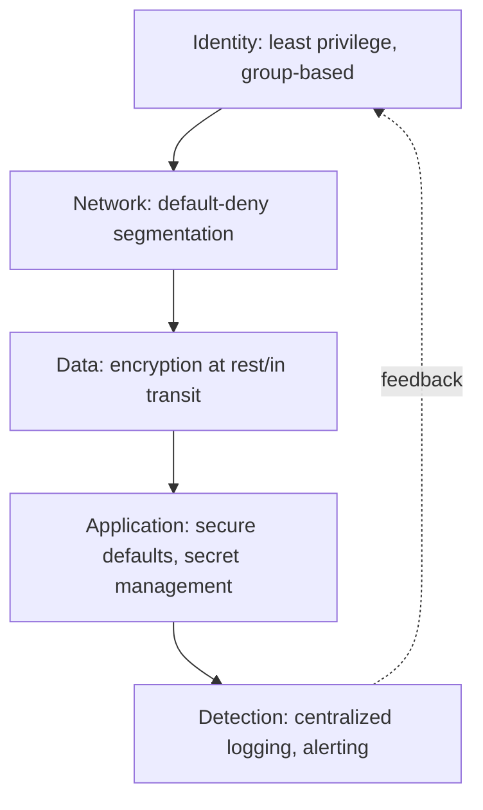

# Security (Domain)

## Overview

Security architecture is defense in depth applied deliberately: no single control is assumed sufficient, and controls are layered so that a failure in one (a leaked credential, a misconfigured firewall rule) doesn't cascade into full compromise.

## Business Problem

Point-in-time security reviews and manually enforced best practices don't scale, and don't survive contact with organizational pressure to move fast — structural, automatically enforced security controls are the only approach that reliably holds up as an organization and its cloud estate grow.

## Architecture

## Design Decisions

- **Defense in depth, not a single control.** Identity, network segmentation, encryption, and detection each independently reduce risk — see `architecture-domains/identity.md` and `architecture-domains/networking.md`.
- **Secrets are referenced, never passed as plain configuration.** Workloads read secrets from Key Vault/Secret Manager at runtime rather than through variables that could land in logs, state files, or version control — see the companion `terraform-enterprise` repository's `docs/09-security.md`.
- **Structural controls over procedural ones wherever possible.** Org policy and policy-as-code (`architecture-domains/governance.md`) that make the wrong thing impossible are preferred over checklists a human might skip under deadline pressure.

## Decision Trade-offs

| Choice | Trade-off |
|---|---|
| Defense in depth | Resilient to any single control's failure; more controls to design, implement, and maintain |
| Structural over procedural controls | Reliable enforcement at scale; less flexible than human judgment for genuinely novel situations |

## Advantages

- No single point of security failure — compromise of one layer doesn't automatically compromise the whole system
- Structural controls (org policy, policy-as-code) hold up under organizational growth and pressure better than procedural ones
- Centralized detection (logging, alerting) shortens incident response time significantly

## Disadvantages

- Defense in depth has real cumulative cost and complexity — more controls, more places for legitimate work to hit friction
- Structural controls require genuine upfront engineering investment before their value is realized
- Over-application of strict controls without regard to context (see `architecture-principles/design-principles.md`) can drive workarounds that undermine security more than a better-calibrated policy would have

## Security Considerations

This entire document is a security domain deep-dive; the recurring theme across every layer is that trust is never assumed from context (network location, "internal" traffic) — it's continuously verified, consistent with `cloud-patterns/zero-trust.md`.

## Operational Considerations

Security-relevant alerts (IAM policy changes, org policy modifications) should carry the highest severity in the alerting model — see the companion `gcp-landing-zone` repository's `docs/09-monitoring-logging.md` — because control-plane changes are leading indicators of both misconfiguration and active compromise.

## Cost Considerations

Security tooling and the engineering time to properly implement defense in depth is a real, ongoing cost — typically justified against the (much larger, if harder to quantify precisely) cost of the incidents it prevents.

## Scalability

Structural security controls scale with the organization without a proportional increase in dedicated security headcount; procedural, review-based security does not.

## Availability

Security and availability sometimes trade off directly (e.g., aggressive automatic lockout policies can themselves cause availability incidents) — this tension should be deliberately reasoned through, not resolved by default in either direction.

## Real Enterprise Scenario

A healthcare company's incident response for a suspected credential compromise took under two hours end-to-end — from detection to full scope determination — specifically because centralized, org-wide audit logging (see `architecture-domains/observability.md`) let the security team query every project's activity for the affected identity in one place, rather than manually querying dozens of separate log stores.

## Common Mistakes

- Relying on a single control (e.g., network segmentation alone) instead of layering identity, network, data, and detection controls independently.
- Passing secrets as plain configuration variables instead of referencing a managed secret store at runtime.
- Under-resourcing the detection/response layer relative to prevention — prevention will eventually fail, and detection speed determines the actual blast radius.

## Interview Questions

- "Walk me through your defense-in-depth model for a typical workload."
- "How do you balance strict security controls against developer velocity?"
- "Describe your approach to secrets management across a multi-team organization."

## Summary

Security architecture layers independent controls — identity, network, data, application, and detection — so no single failure cascades into full compromise, favoring structural, automatically enforced controls over procedural ones wherever the trade-off allows.

## Further Reading

- Companion repositories: `gcp-landing-zone` `docs/07-iam-security.md` and `docs/09-monitoring-logging.md`; `terraform-enterprise` `docs/09-security.md`
- `cloud-patterns/zero-trust.md`
- `best-practices/cloud-security-checklist.md`
