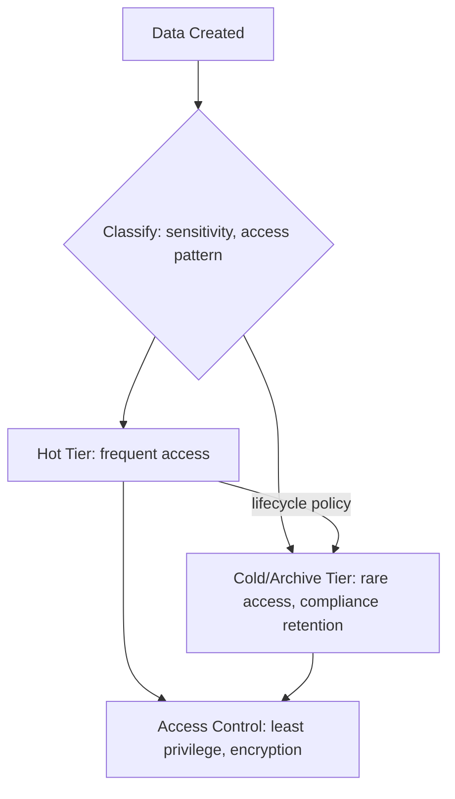

# Storage (Domain)

## Overview

Storage architecture decides where data lives, how durably, how it's tiered by access frequency, and who can reach it — decisions that are often harder to change after the fact than compute choices, because data has gravity: it's expensive and risky to move once workloads depend on its location.

## Business Problem

Uniform storage — treating all data the same regardless of access pattern, sensitivity, or retention requirement — is both expensive (hot storage for rarely-accessed data) and risky (no differentiated access control for sensitive versus non-sensitive data).

## Architecture

## Design Decisions

- **Tiered storage by access pattern**, with automated lifecycle policies moving data from hot to cold/archive tiers based on age — not manual, easily-forgotten migration.
- **Uniform access control enforced structurally** — public access prevention enabled by default (see the companion `terraform-enterprise` repository's `gcp/storage` module), requiring a deliberate, reviewed exception to make anything public.
- **Encryption at rest by default**, with customer-managed keys reserved for data with specific regulatory requirements rather than applied universally (where the key management overhead wouldn't be justified).

## Decision Trade-offs

| Choice | Trade-off |
|---|---|
| Automated lifecycle tiering | Significant cost savings for infrequently accessed data; added retrieval latency/cost if cold data is unexpectedly needed urgently |
| Public access prevention by default | Eliminates an entire class of accidental data exposure incidents; requires an explicit, reviewed process for the legitimate cases needing public access |
| Customer-managed encryption keys selectively | Avoids unnecessary key management overhead for most data; requires careful tracking of which data actually has regulatory requirements demanding it |

## Advantages

- Automated tiering can reduce storage costs substantially for data with predictable access-frequency decay (logs, backups, historical records)
- Default-secure access control (no public access without deliberate exception) prevents the single most common cloud data exposure incident category
- Clear data classification makes compliance requirements (retention, residency) tractable to enforce systematically

## Disadvantages

- Lifecycle policies require accurate access-pattern assumptions — misclassified data either costs more than necessary (staying hot) or becomes expensive/slow to retrieve unexpectedly (moved to archive prematurely)
- Data classification itself is an ongoing organizational discipline, not a one-time technical setup — new data needs to be classified as it's created, not retroactively
- Public-access-prevention-by-default occasionally creates friction for genuinely public use cases (public assets, open datasets) that need an explicit exception process

## Security Considerations

Storage is one of the most common sources of cloud data exposure incidents, almost always due to accidental public access rather than sophisticated attack — structural prevention (as in `architecture-domains/security.md`) is disproportionately valuable here relative to procedural review alone.

## Operational Considerations

Storage lifecycle policies should be defined declaratively (as code) alongside the storage resource itself, not configured manually in a console where they're easy to forget or misconfigure inconsistently across projects.

## Cost Considerations

Storage cost is driven by three largely independent levers — capacity, access/retrieval frequency, and data transfer — and cost optimization requires addressing all three; capacity-only optimization (choosing a cheaper storage class) without addressing access patterns can backfire if retrieval costs exceed the storage savings.

## Scalability

Object storage services generally scale to enormous capacity without architectural changes; the scaling challenge is usually in access patterns (request rate limits, hot-partition problems) rather than raw capacity.

## Availability

Storage durability (data survives) and availability (data is reachable) are distinct — a highly durable storage class can still have an availability SLA gap during a regional incident; multi-region replication (`cloud-patterns/multi-region.md`) addresses availability, not just durability.

## Real Enterprise Scenario

A media company reduced storage costs by roughly 60% after implementing automated lifecycle policies moving video assets older than 90 days to a cold tier — a saving that had gone unrealized for years because assets were manually tiered only when someone remembered, which was rarely.

## Common Mistakes

- Leaving all data in the hot/standard tier indefinitely because lifecycle policies were never configured.
- Disabling public access prevention broadly "to make it easier" instead of handling the specific legitimate use case with a scoped exception.
- Applying customer-managed encryption keys universally, adding key-management operational overhead without a corresponding regulatory requirement driving it.

## Interview Questions

- "How would you design a storage lifecycle policy for a media company's video assets?"
- "What's your default posture on public bucket/container access, and how do you handle legitimate exceptions?"
- "How do you decide when customer-managed encryption keys are actually necessary?"

## Summary

Storage architecture combines automated lifecycle tiering by access pattern, default-secure access control, and selectively applied customer-managed encryption — treating data classification as an ongoing organizational discipline rather than a one-time setup task.

## Further Reading

- Companion repository: `terraform-enterprise`, `modules/gcp/storage`
- `architecture-domains/governance.md`, `architecture-domains/security.md`
