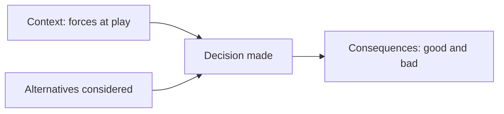

# Architecture Decision Records (Practice)

## Overview

An Architecture Decision Record (ADR) is a short document capturing a single significant architectural decision, the context that drove it, and its consequences. This document describes how ADRs are practiced in this repository and, by extension, how they should be practiced on a real architecture team.

## Business Problem

Architecture decisions made in meetings or Slack threads evaporate — six months later, nobody can reconstruct why a team chose a hub-and-spoke topology over a mesh, and the decision gets silently re-litigated or, worse, silently violated by someone who didn't know it was deliberate.

## Architecture

## Design Decisions

- ADRs are **numbered and immutable** — a changed decision gets a new ADR that supersedes the old one, rather than an edit that erases the original reasoning.
- ADRs document **rejected alternatives**, not just the chosen path — this is often the most valuable part for a future reader wondering "why didn't we just do X."
- ADRs are **short** — one to two pages. A document that takes 20 minutes to read won't get read by the people who need it during an incident.

## Decision Trade-offs

| Approach | Pros | Cons |
|---|---|---|
| Lightweight ADRs (this repo's approach) | Low friction, likely to actually get written | Less exhaustive than a full design doc |
| Full design documents for every decision | More thorough | High friction; often skipped under deadline pressure, defeating the purpose |

## Advantages

- Onboarding new architects/engineers is dramatically faster with a readable decision history
- Prevents re-litigating settled decisions without new information
- Creates institutional memory independent of any single person staying at the company

## Disadvantages

- Requires discipline to keep current; a stale or incomplete ADR log is worse than none, because it creates false confidence
- Not every decision warrants an ADR — over-application creates noise (see Common Mistakes)

## Security Considerations

Security-relevant decisions (e.g., "we chose network-level isolation over application-level" — see `architecture-decision-records/adr-005-security.md`) are exactly the kind of decision most valuable to preserve, since security posture is frequently questioned during audits and the reasoning needs to be reconstructable.

## Operational Considerations

ADRs should live in version control alongside (or referencing) the infrastructure code they govern, so they're discoverable by anyone reading that code — not buried in a separate wiki nobody checks.

## Cost Considerations

The cost of writing an ADR (30-60 minutes) is trivial compared to the cost of a team re-debating a settled decision, or worse, silently drifting away from it without anyone noticing.

## Scalability

ADR practice scales from a single architect to a multi-team organization without modification — the format doesn't change, only the volume and the review process around proposing one.

## Availability

Not directly applicable.

## Real Enterprise Scenario

A financial services platform team inherited a Kubernetes cluster architecture with no documented rationale for why namespaces were used for tenant isolation instead of separate clusters. Without an ADR, the incoming team spent three weeks re-deriving the reasoning (compliance auditors required node-level isolation evidence they couldn't easily produce) before deciding to migrate to per-tenant clusters — a decision the original team had actually already considered and rejected for cost reasons that no longer applied at the new scale. An ADR would have saved the re-derivation entirely, even though the eventual decision to migrate might have been the same.

## Common Mistakes

- Writing an ADR for every trivial choice, burying genuinely significant decisions in noise.
- Editing an old ADR in place instead of superseding it, destroying the historical record.
- Writing ADRs after the fact, from memory, once someone insists "we need documentation" — the alternatives-considered section is usually the first casualty.

## Interview Questions

- "Walk me through how you'd document a significant architecture decision."
- "How do you decide what warrants an ADR versus what doesn't?"
- "Tell me about a decision you'd make differently now — how would you have documented that change?"

## Summary

ADRs are a lightweight, durable record of significant architecture decisions — context, decision, and consequences — practiced consistently in this repository's `architecture-decision-records/` directory and recommended as standard practice for any architecture team.

## Further Reading

- `architecture-decision-records/adr-template.md`
- `architecture-decision-records/adr-001-landing-zone.md` through `adr-005-security.md`
