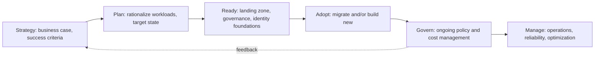

# Cloud Adoption Framework (This Repository's Approach)

## Overview

A cloud adoption framework is the staged model an organization follows to move from "no cloud presence" to "cloud as the default operating model." This document describes the framework used implicitly across this repository's reference architectures and case studies — not a copy of any vendor's published framework, but the reasoning pattern this repository applies consistently.

## Business Problem

Organizations that skip a deliberate adoption sequence — jumping straight to workload migration without governance, identity, or landing zone foundations — accumulate technical and governance debt that's dramatically more expensive to unwind later than to avoid up front.

## Architecture

## Design Decisions

- **Landing zone before workload migration, always.** Every reference architecture in this repository assumes the landing zone (`cloud-patterns/landing-zone.md`) exists before the first production workload lands — retrofitting governance onto an established, ungoverned estate is dramatically harder than building it first.
- **Rationalize before migrating.** Not every workload should move as-is ("lift and shift"); some should be retired, replatformed, or rearchitected. This repository's case studies model that decision explicitly rather than assuming uniform migration strategy.
- **Governance is continuous, not a phase.** Unlike strategy/plan/ready/adopt, which have a natural sequence, govern and manage run continuously alongside and after adoption — this framework treats them as an ongoing loop, not a final step.

## Decision Trade-offs

| Approach | Pros | Cons |
|---|---|---|
| Landing zone first, then migrate | Governance and security are structural from day one | Slower initial time-to-first-workload |
| Migrate first, govern later | Faster initial wins, demonstrates value quickly | Expensive governance retrofit; frequently never actually happens |

## Advantages

- Reduces the "cloud sprawl" failure mode where hundreds of ungoverned projects/subscriptions accumulate before anyone builds guardrails
- Creates natural checkpoints for stakeholder alignment (a strategy phase that never produces a business case is a valuable early signal)
- Separates "can we migrate this workload" from "should we migrate this workload," which are frequently conflated

## Disadvantages

- A staged framework can become bureaucratic if treated as a rigid gate process rather than a reasoning aid
- Organizations under acute pressure (e.g., a data center lease expiring in 90 days) may not have the luxury of a full strategy/plan/ready sequence — the framework needs to compress gracefully under pressure, not just linearly

## Security Considerations

Security and compliance requirements are far cheaper to design into the "ready" phase (landing zone, IAM, governance) than to retrofit during or after "adopt" — this is one of the strongest arguments for the sequence, not just a nice-to-have.

## Operational Considerations

The "manage" phase is where most cloud adoption frameworks get the least real investment relative to their importance — organizations plan the migration in detail and then significantly under-resource ongoing operations, reliability, and cost optimization.

## Cost Considerations

Rationalization (deciding what not to migrate) is frequently the single highest-leverage cost decision in an entire adoption program — retiring genuinely obsolete workloads instead of migrating them is invisible in a migration plan's workload count but can be the largest cost saving in the whole effort.

## Scalability

This framework scales down to a single-team migration and up to a multi-year, multi-thousand-workload enterprise program without structural change — only the rigor and formality of each phase changes.

## Availability

Not directly applicable to this document.

## Real Enterprise Scenario

A manufacturing company under pressure from an expiring data center lease attempted to skip straight to "adopt," migrating workloads without a landing zone. Within four months they had 40+ ungoverned subscriptions/projects, no consistent tagging, and no idea which workloads owned which data. A forced pause to retrofit a landing zone and governance baseline cost roughly six weeks — expensive, but far cheaper than the alternative of continuing to scale on an ungoverned foundation. See `case-studies/hybrid-cloud-strategy.md` for the fuller narrative.

## Common Mistakes

- Treating "strategy" and "plan" as one-time upfront phases instead of revisiting them as the program learns more.
- Migrating every workload with the same strategy (lift-and-shift for everything, or rearchitect everything) instead of workload-by-workload rationalization.
- Under-investing in the "manage" phase because the program is declared "done" once migration completes.

## Real Enterprise Scenario

(See above.)

## Interview Questions

- "How would you sequence a cloud adoption program for an organization with a hard deadline?"
- "What criteria would you use to decide whether a workload should be lift-and-shifted, replatformed, or retired?"
- "How do you keep governance from becoming a bottleneck during a large migration program?"

## Summary

This repository's implicit cloud adoption framework — strategy, plan, ready, adopt, and a continuous govern/manage loop — prioritizes landing zone and governance foundations before workload migration, and treats workload rationalization as a first-class decision rather than assuming uniform migration strategy.

## Further Reading

- `cloud-patterns/landing-zone.md`
- `case-studies/hybrid-cloud-strategy.md`, `case-studies/enterprise-modernization.md`
