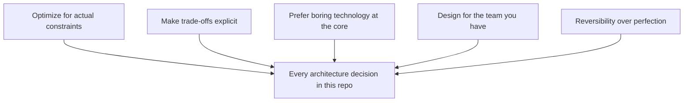

# Design Principles

## Overview

These are the principles every document in this repository is written against. They aren't universal truths — they're the specific stance this repository takes, stated up front so the reasoning in every pattern, domain, and reference architecture is legible rather than assumed.

## Business Problem

Architecture guidance that doesn't state its own assumptions is unfalsifiable — a reader can't tell whether a recommendation applies to their situation or was written for a different one entirely (a hyperscale consumer product vs. a 200-person B2B SaaS company, for instance). Stating principles explicitly lets a reader disagree productively instead of just disagreeing.

## Architecture

## Design Decisions

1. **Optimize for the organization's actual constraints, not textbook ideals.** A 40-person startup and a 4,000-person bank both "need a landing zone," but the right landing zone is different in scope, governance rigor, and team structure. This repository's reference architectures state their assumed organizational context explicitly.
2. **Make trade-offs explicit, always.** Every pattern in `cloud-patterns/` documents what you give up, not just what you gain — a document with no listed disadvantages hasn't been reasoned through honestly.
3. **Prefer boring, well-understood technology at the core of a platform.** Novel technology choices are made deliberately and sparingly, at the edges, where the payoff clearly outweighs the operational unfamiliarity cost.
4. **Design for the operability the team will actually have**, not the operability a larger, more specialized team could provide. A design that requires a dedicated SRE team is wrong for an organization that doesn't have one, however elegant it is on paper.
5. **Prefer reversible decisions over perfect ones**, especially early. A landing zone folder structure is cheap to adjust later; an organization-wide IAM model is not — invest reasoning effort proportional to reversal cost.

## Decision Trade-offs

| Principle | What you gain | What you give up |
|---|---|---|
| Optimize for actual constraints | Designs that actually get adopted and operated well | Less "universally applicable" advice; more caveats |
| Boring technology at the core | Lower operational risk, easier hiring | Slower to adopt genuinely superior new approaches |
| Design for the team you have | Sustainable operations | Sometimes a technically inferior design is the right organizational choice |

## Advantages

- Produces designs an organization can actually operate, not just deploy once
- Makes architecture reviews faster because assumptions are already stated
- Reduces the "it worked in the blog post" failure mode

## Disadvantages

- Requires more upfront honesty about organizational limitations, which can be uncomfortable in a review
- Principles-based guidance is harder to reduce to a simple checklist than "always do X"

## Security Considerations

Security-relevant trade-offs are a recurring case where "optimize for actual constraints" can be misapplied to justify skipping a control because it's inconvenient. This repository treats a small set of security principles (least privilege, defense in depth) as non-negotiable regardless of organizational size — see `architecture-domains/security.md`.

## Operational Considerations

A design's operational cost is a first-class input to every decision here, not an afterthought evaluated after the architecture is chosen. "Who is on call for this, and do they have the skills to debug it at 2am" is asked at design time.

## Cost Considerations

Boring-technology-at-the-core also tends to be a cost-optimization principle: mature, well-understood services usually have more predictable, better-understood cost profiles than bleeding-edge alternatives.

## Scalability

These principles scale down more gracefully than most architecture guidance — a small team applying "design for the team you have" arrives at an appropriately smaller design, rather than a scaled-down version of an enterprise pattern that doesn't fit.

## Availability

Not directly applicable to this document; see `architecture-domains/disaster-recovery.md` for availability-specific principles.

## Real Enterprise Scenario

A mid-size healthcare company's platform team was pressured to adopt a service mesh because "that's what a modern architecture uses." Applying "design for the team you have," the actual decision was to defer mesh adoption until the team grew past three platform engineers — the operational cost of running a mesh well exceeded the team's current capacity, and a simpler ingress/egress model met their actual requirements for another 18 months.

## Common Mistakes

- Treating a principle as an absolute rule rather than a lens for reasoning about a specific situation.
- Copying a reference architecture's specifics without adapting to a different organizational context.
- Confusing "boring technology" with "outdated technology" — boring means mature and well-understood, not old.

## Interview Questions

- "Tell me about a time you recommended a simpler architecture than what was initially proposed. Why?"
- "How do you decide when a trade-off is worth making?"
- "What's a technology choice you'd make differently for a 10-person team versus a 1,000-person team?"

## Summary

These five principles — actual constraints over textbook ideals, explicit trade-offs, boring technology at the core, designing for the team you have, and reversibility over perfection — are the lens through which every other document in this repository should be read.

## Further Reading

- `architecture-principles/enterprise-architecture.md`
- `architecture-principles/architecture-decision-records.md`
