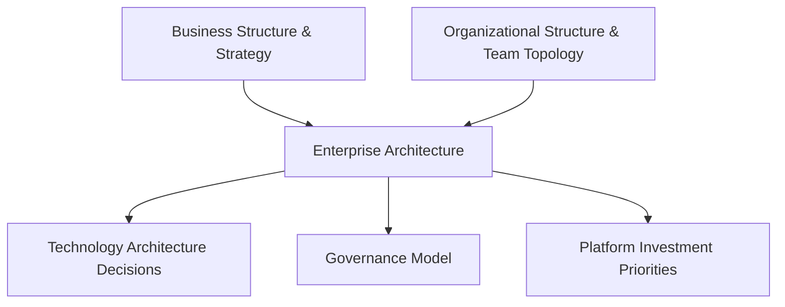

# Enterprise Architecture

## Overview

Enterprise architecture is the discipline of aligning technology structure with business structure — ensuring that how systems are organized reflects how the organization actually operates and makes decisions, not an idealized org chart. This document defines how enterprise architecture is practiced across this repository's other content.

## Business Problem

Technology built without regard to organizational structure tends to fail along Conway's Law lines: a platform designed for a centralized team doesn't work when ownership is actually federated across ten autonomous business units, and vice versa. Enterprise architecture exists to make that alignment deliberate rather than accidental.

## Architecture

## Design Decisions

- Enterprise architecture in this repository starts from **organizational reality**, not a reference architecture — the landing zone folder structure in `cloud-patterns/landing-zone.md` is explicitly environment-first because that matched the case study organization's actual risk model, not because it's universally correct (see `docs/03-folder-hierarchy.md` in the companion `gcp-landing-zone` repository for the same reasoning applied concretely).
- A **federated governance model** (central guardrails, delegated implementation) is the default assumption across this repository's reference architectures, reflecting how most enterprises past a certain size actually operate — fully centralized IT rarely survives contact with more than a few hundred engineers.

## Decision Trade-offs

| Model | Pros | Cons |
|---|---|---|
| Centralized EA function | Strong consistency, easier top-down governance | Becomes a bottleneck at scale; slower for business units |
| Federated EA (central guardrails + delegated teams) | Scales with organizational growth, faster for teams | Requires stronger platform tooling to keep guardrails enforced without manual review |

## Advantages

- Produces designs that survive contact with real organizational politics and constraints
- Creates a shared vocabulary between technology and business stakeholders
- Makes platform investment prioritization traceable to business strategy

## Disadvantages

- Enterprise architecture work is slower and more political than pure technical design — expect friction
- A federated model requires genuine investment in tooling/guardrails, or governance quietly erodes

## Security Considerations

Security posture is one of the clearest places enterprise architecture and technology architecture must align — a federated organization needs security guardrails enforced structurally (org policy, hierarchical firewall policy — see the companion `gcp-landing-zone` repository) precisely because it can't rely on centralized manual review at scale.

## Operational Considerations

Enterprise architecture decisions should be revisited on a cadence tied to organizational change (a reorg, an acquisition, a major strategy shift) — not left static indefinitely, and not re-litigated on every minor team change either.

## Cost Considerations

Misalignment between organizational and technology structure is expensive in a way that's hard to see on a budget line — it shows up as duplicated platform investment across business units that don't coordinate, or as a central platform team perpetually understaffed relative to the delegation model chosen.

## Scalability

Federated governance models scale considerably better than centralized ones as organizations grow past a few hundred engineers — see `cloud-patterns/landing-zone.md` and `cloud-patterns/shared-services.md` for the technical patterns that support this at the infrastructure layer.

## Availability

Not directly applicable to this document.

## Real Enterprise Scenario

A global media company's enterprise architecture team had, for years, mandated a single centrally-managed VPC per region for all business units. As the company grew through acquisition to twelve semi-autonomous divisions, this became an operational bottleneck — every new subnet request queued behind a single overworked networking team. The enterprise architecture fix wasn't a new networking pattern; it was recognizing that the organization had already become federated in practice, and the technology governance model needed to catch up — leading to the Shared VPC-based landing zone described in `case-studies/enterprise-modernization.md`.

## Common Mistakes

- Designing a centralized technology model for an organization that operates in a federated way (or vice versa) — see Conway's Law.
- Treating enterprise architecture as a purely technical exercise, disconnected from actual business strategy conversations.
- Freezing an enterprise architecture model and failing to revisit it after a major organizational change like an acquisition.

## Interview Questions

- "How would you design governance for an organization with 15 largely autonomous business units?"
- "Tell me about a time technology architecture and organizational structure were misaligned. How did you fix it?"
- "What's the difference between enterprise architecture and solution architecture, in your own words?"

## Summary

Enterprise architecture aligns technology structure with actual organizational structure and strategy. This repository defaults to a federated governance model — central guardrails, delegated implementation — because it's what most enterprises past a modest size actually need, while making that assumption explicit rather than universal.

## Further Reading

- `architecture-principles/cloud-adoption-framework.md`
- `cloud-patterns/landing-zone.md`, `cloud-patterns/shared-services.md`
- `case-studies/enterprise-modernization.md`
