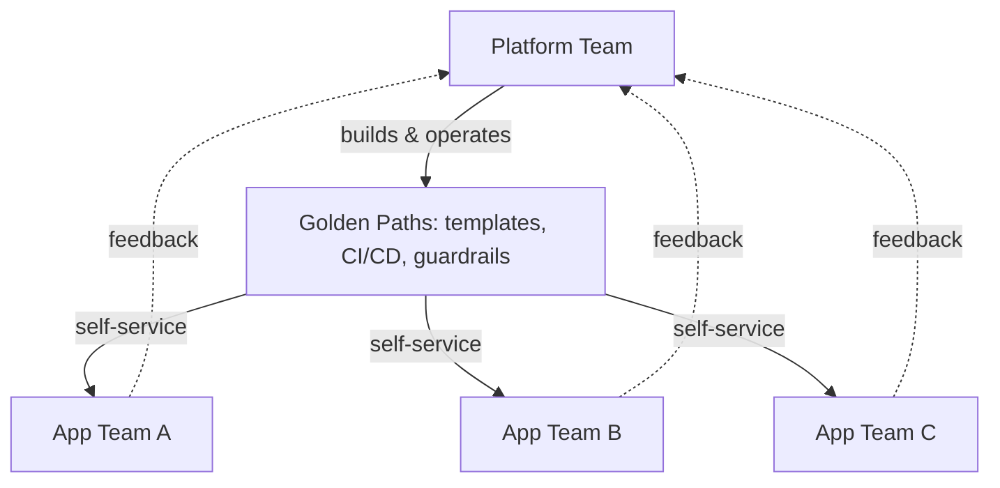

# Platform Engineering (Principle)

## Overview

Platform engineering is the discipline of building an internal product — a platform — that application teams consume, with the same product-management rigor applied to any external-facing product: understanding users, reducing friction, and measuring adoption. This document states the principle; `architecture-domains/platform-engineering.md` covers the domain in technical depth.

## Business Problem

Without a deliberate internal platform, every application team re-solves the same infrastructure problems — CI/CD, observability, secrets management — at wildly inconsistent quality, and the organization's best infrastructure engineers spend their time as a support queue for individual teams' one-off requests instead of building leveraged, reusable capability.

## Architecture

## Design Decisions

- **The platform is a product, with a roadmap and users, not a shared-services ticket queue.** This changes how the platform team prioritizes — adoption and developer experience metrics matter as much as uptime.
- **Golden paths, not mandates.** The platform provides a well-supported default path (a service template, a standard CI/CD pipeline) that's easier to use than the alternative, rather than banning teams from deviating — see `architecture-domains/platform-engineering.md` for how this differs from pure policy enforcement.
- **Self-service over request queues.** Every capability the platform provides should be usable without a ticket to the platform team, or the platform has failed at its core job.

## Decision Trade-offs

| Approach | Pros | Cons |
|---|---|---|
| Golden paths (opinionated defaults, escape hatches available) | High adoption, teams stay unblocked | Requires ongoing platform investment to keep the golden path genuinely good |
| Mandates (hard policy enforcement, no deviation) | Simpler to reason about, easier to audit | Teams route around it or find the platform obstructive, undermining adoption |

## Advantages

- Frees the organization's best infrastructure engineers to build leveraged capability instead of doing one-off support
- Produces consistent security/observability/reliability posture across teams without heavy manual review
- Improves developer velocity by removing repeated, low-value infrastructure work from every team

## Disadvantages

- Requires genuine, sustained investment — a platform team that's under-resourced becomes a bottleneck instead of an accelerant
- Product-thinking discipline (understanding users, measuring adoption) doesn't come naturally to teams with an infrastructure engineering background and needs deliberate cultivation

## Security Considerations

A well-designed platform is one of the highest-leverage security investments an organization can make — baking secure defaults (e.g., the Shared VPC and IAM patterns in the companion `gcp-landing-zone` repository) into the golden path means every team gets them by default, without relying on every individual engineer making the right call.

## Operational Considerations

Platform teams need on-call rotations and SLOs like any other product team — treating the platform as "infrastructure that just runs" rather than a supported product with reliability commitments undermines the trust that drives adoption.

## Cost Considerations

Platform investment has a clear ROI case (engineering time saved across every consuming team) but a delayed payoff — building golden paths takes real upfront investment before the multiplicative benefit is visible, which can be a hard sell in a budget-constrained environment.

## Scalability

Platform engineering's leverage increases with the number of consuming teams — the same investment pays off more as an organization grows, which is why it's usually justified first at a few dozen engineering teams and becomes essential well beyond that.

## Availability

Not directly applicable to this document; see `architecture-domains/platform-engineering.md` for platform reliability commitments (SLOs).

## Real Enterprise Scenario

A financial services company's dozen application teams each built their own CI/CD pipeline from scratch, with wildly inconsistent security scanning coverage — some teams had none. A platform team built a single golden-path pipeline template with mandatory security scanning baked in, but adoption stalled until they added a self-service onboarding flow and dedicated a team member to office hours for the first quarter. Adoption went from 2 teams to 11 of 12 within two quarters once the friction to switch dropped below the friction to keep maintaining a bespoke pipeline. See `case-studies/kubernetes-adoption.md` for a related platform adoption narrative.

## Common Mistakes

- Building a platform without talking to consuming teams first, producing something technically sound but not actually adopted.
- Measuring platform success by what was built rather than by adoption and developer experience.
- Treating "golden path" as a euphemism for "the only path," which produces the same adoption resistance as a hard mandate.

## Interview Questions

- "How do you measure whether a platform investment is succeeding?"
- "Tell me about a platform capability that had low adoption. What did you do?"
- "How do you balance golden-path opinionation against team autonomy?"

## Summary

Platform engineering treats internal infrastructure as a product with real users, prioritizing self-service golden paths over either unstructured freedom or rigid mandates. This principle underlies both `architecture-domains/platform-engineering.md` and the Kubernetes platform patterns in `reference-architectures/kubernetes-platform.md`.

## Further Reading

- `architecture-domains/platform-engineering.md`
- `reference-architectures/kubernetes-platform.md`
- `case-studies/kubernetes-adoption.md`
