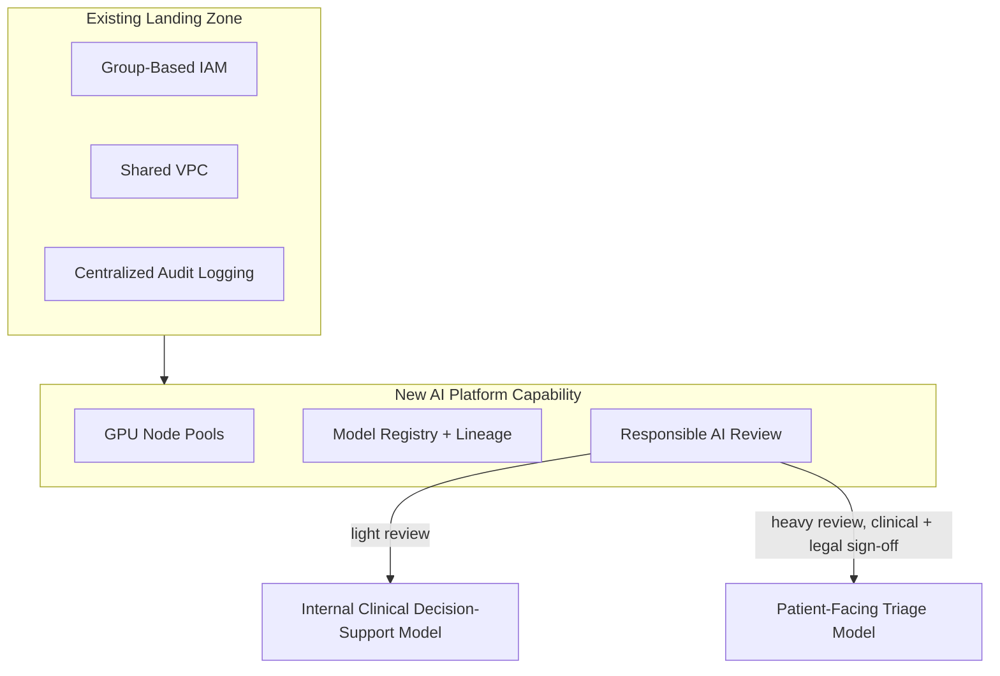

# Case Study: Healthcare Company — AI Cloud Adoption

## Overview

A healthcare company built an enterprise AI platform on top of their existing landing zone, following the pattern documented in `reference-architectures/ai-platform.md`, to support both internal clinical decision-support tooling and a patient-facing symptom-triage model.

## Business Problem

The company needed to move quickly on AI capability to stay competitive, but their existing security and compliance posture (built for a healthcare regulatory context, per `architecture-domains/security.md`'s real enterprise scenario) couldn't be compromised for speed. They needed an AI platform that inherited their existing governance rigor rather than creating a parallel, less-governed track.

## Current State

- An established, well-governed landing zone (the same one referenced throughout `architecture-domains/security.md` and `architecture-domains/identity.md`'s real enterprise scenarios) with group-based IAM and centralized audit logging already in place
- No existing ML infrastructure — this was a genuinely new capability being added
- Two proposed AI use cases with very different risk profiles: an internal clinical decision-support tool (used by clinicians, with a human always making the final call) and a patient-facing symptom-triage model (higher stakes, direct patient interaction)

## Challenges

- Extending the existing landing zone with AI-specific infrastructure (GPU capacity, data pipelines) without creating governance inconsistency
- Establishing a responsible-AI review process for a healthcare context, essentially from scratch, requiring genuine cross-functional collaboration with clinical and legal stakeholders
- Applying appropriately different levels of rigor to the two very differently-risked use cases without either under- or over-governing either one

## Architecture

The company built the AI platform as an extension of their existing landing zone (`reference-architectures/ai-platform.md`) — AI workload projects were ordinary service projects attached to the existing Shared VPC, inheriting the existing group-based IAM model, with new GPU-capable node pools and a model registry added as genuinely new capability.

## Migration Strategy

Not applicable in the traditional migration sense — this was new capability built on existing foundations, following the same "extend, don't parallel-build" principle as `reference-architectures/ai-platform.md` recommends generally.

## Security

Training data for both models included regulated patient data, requiring the same data classification and access control rigor as any other regulated data in the existing landing zone (`architecture-domains/storage.md`) — with the added consideration, raised by legal counsel during review, that the trained models themselves needed evaluation for potential training-data leakage risk.

## Governance

The two use cases received deliberately different review rigor: the internal clinical decision-support tool (always human-reviewed before any action) went through a lighter review process, while the patient-facing triage model (direct-to-patient, higher stakes) required full clinical and legal sign-off before deployment — a concrete application of the risk-proportional review principle from `reference-architectures/ai-platform.md`.

## Results

- The internal clinical decision-support tool reached production in approximately 10 weeks, benefiting from the lighter review track and the existing landing zone's IAM/network foundation requiring no rebuilding
- The patient-facing triage model took approximately 7 months, the majority of that time in the responsible-AI review process (clinical validation, bias evaluation across patient demographics, legal sign-off) — a deliberately longer timeline reflecting its genuinely higher stakes
- Zero governance inconsistency findings in a subsequent compliance audit, directly attributed to building the AI platform as an extension of existing governance rather than a parallel track

## Lessons Learned

- Building on the existing landing zone rather than standing up parallel AI-specific infrastructure was the single highest-leverage decision in the entire initiative — it meant AI workloads inherited years of accumulated security and compliance investment instead of starting from zero
- Risk-proportional review (light for internal tooling, heavy for patient-facing) let the company move quickly where genuinely safe to do so, while still taking the necessary time where stakes were higher — avoiding both reckless speed and blanket over-caution
- Establishing the responsible-AI review process required real, ongoing cross-functional relationship-building with clinical and legal stakeholders — a organizational, not purely technical, undertaking

## Common Mistakes

The company deliberately avoided the "separate, parallel AI platform" mistake described in `reference-architectures/ai-platform.md`'s Common Mistakes section, having seen a peer healthcare organization struggle with exactly that governance-inconsistency problem.

## Interview Questions

- "How would you extend an existing, well-governed landing zone to support a new AI platform?"
- "How do you design a risk-proportional review process across use cases with genuinely different stakes?"
- "What healthcare-specific considerations would you add to a standard responsible-AI review process?"

## Summary

This healthcare company's AI platform build succeeded by extending their existing, well-governed landing zone rather than building parallel infrastructure, and by applying deliberately different review rigor to two use cases with genuinely different risk profiles — reaching production quickly for the lower-stakes internal tool while taking the necessary longer path for the patient-facing model.

## Further Reading

- `reference-architectures/ai-platform.md`
- `architecture-domains/security.md`, `architecture-domains/storage.md`
