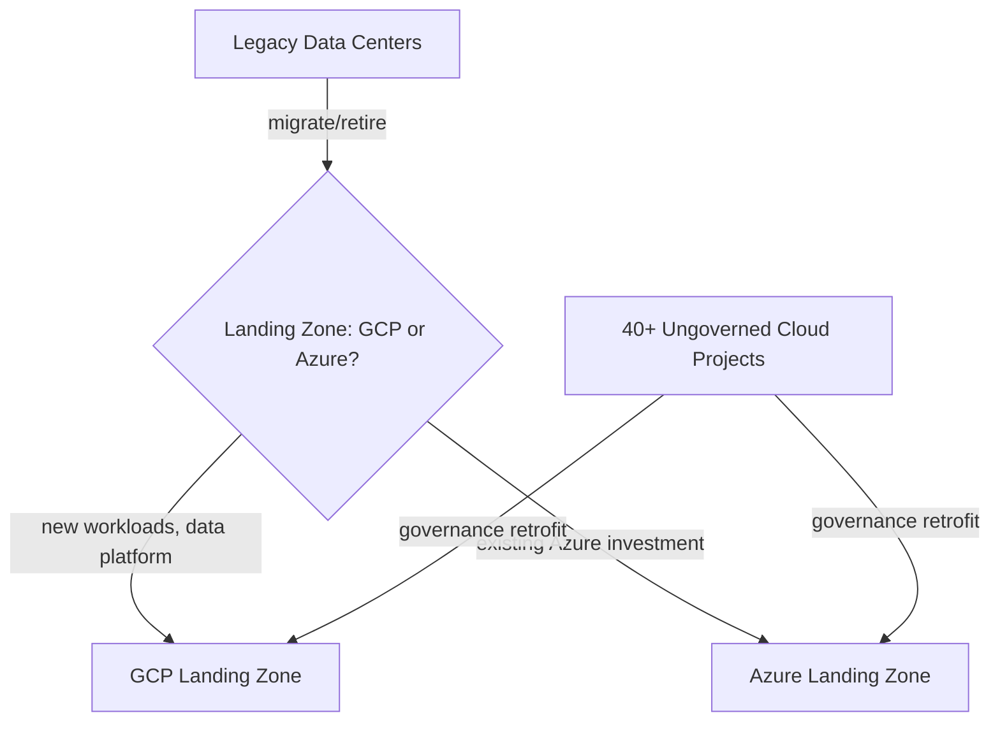

# Case Study: Global Retail Company — Enterprise Modernization

## Overview

A global retail company ("Northwind Retail," used consistently across this repository's companion Terraform repositories) with twelve business units, operating a mix of aging on-prem data centers and ungoverned early cloud experiments, undertook a two-year enterprise modernization program.

## Business Problem

Northwind's data center lease was expiring in 18 months. Simultaneously, five business units had independently started cloud experiments with no central governance, producing 40+ ungoverned projects/subscriptions with inconsistent naming, no consistent tagging, and no coherent security posture. Leadership needed both a migration plan and a governance retrofit, under real time pressure.

## Current State

- Two on-prem data centers, one with an expiring lease
- Five business units running ungoverned cloud projects/subscriptions across both Azure and GCP
- No central identity federation — each cloud experiment used separately created credentials
- No consistent logging or monitoring baseline across environments

## Challenges

- Time pressure (18-month lease deadline) conflicting with the "landing zone before migration" principle (`architecture-principles/cloud-adoption-framework.md`)
- Twelve business units with genuinely different risk profiles and technical maturity levels
- Political resistance from business units that had already invested in their own (ungoverned) cloud setups and didn't want to be told to migrate

## Architecture

The program adopted the environment-first landing zone pattern (`cloud-patterns/landing-zone.md`, `architecture-decision-records/adr-001-landing-zone.md`) on GCP for new workloads, plus an Azure landing zone (`reference-architectures/azure-enterprise.md`) for business units with existing Azure-specific investments — a deliberate dual-cloud outcome driven by actual organizational history, not a green-field "pick one cloud" luxury.

## Migration Strategy

Workloads were rationalized (not uniformly lift-and-shifted) into four categories: retire (genuinely obsolete, roughly 15% of workloads), replatform (move with modest changes, roughly 50%), rearchitect (significant redesign, roughly 20%), and retain temporarily on-prem in a colocation facility for workloads that couldn't meet the 18-month deadline safely (roughly 15%), with a follow-on migration plan for those.

## Security

The ungoverned cloud projects were brought under the new landing zone's governance incrementally, business unit by business unit, starting with the highest-risk (Payments, handling card data) — see `architecture-decision-records/adr-004-kubernetes.md` for how this same company's later Kubernetes platform work applied a similar risk-based sequencing.

## Governance

A six-week forced pause (described in `architecture-principles/cloud-adoption-framework.md`'s real enterprise scenario) was required specifically to retrofit governance onto the already-ungoverned projects before continuing migration — an explicitly acknowledged cost of not having built the landing zone first, used internally as the justification for insisting on landing-zone-first sequencing for all subsequent work.

## Results

- Reduced total cloud spend by an estimated 22% within the first year post-migration, primarily through the workload rationalization (retiring genuinely obsolete workloads) rather than migration efficiency alone
- Cut the number of ungoverned, non-compliant projects from 40+ to zero within two quarters of governance retrofit
- Achieved data center exit within the 18-month deadline, with the 15% "retain temporarily" workloads migrated over the following two quarters

## Lessons Learned

- Time pressure is real and legitimate, but skipping landing zone foundations to save time cost more time overall (the forced six-week pause) than building it first would have
- Workload rationalization was the single highest-leverage cost decision in the entire program — bigger than any migration efficiency optimization
- Political resistance from business units with existing (ungoverned) investments required executive sponsorship to overcome — a purely technical argument for governance wasn't sufficient on its own

## Common Mistakes

- Northwind's five business units' initial ungoverned cloud experiments are themselves the cautionary example this entire case study exists to illustrate — see `cloud-patterns/landing-zone.md`'s Common Mistakes section.

## Interview Questions

- "How would you sequence a modernization program under a hard deadline while still getting governance right?"
- "How do you get business units with existing ungoverned investments to buy into a new governance model?"
- "What criteria would you use for the retire/replatform/rearchitect/retain decision?"

## Summary

Northwind Retail's enterprise modernization program combined a landing-zone-first governance retrofit with workload rationalization under real time pressure, achieving both the data center exit deadline and a meaningful cost reduction — at the cost of a forced pause to retrofit governance that landing-zone-first sequencing would have avoided.

## Further Reading

- `architecture-principles/cloud-adoption-framework.md`
- `cloud-patterns/landing-zone.md`
- `case-studies/landing-zone-implementation.md`, `case-studies/hybrid-cloud-strategy.md`
