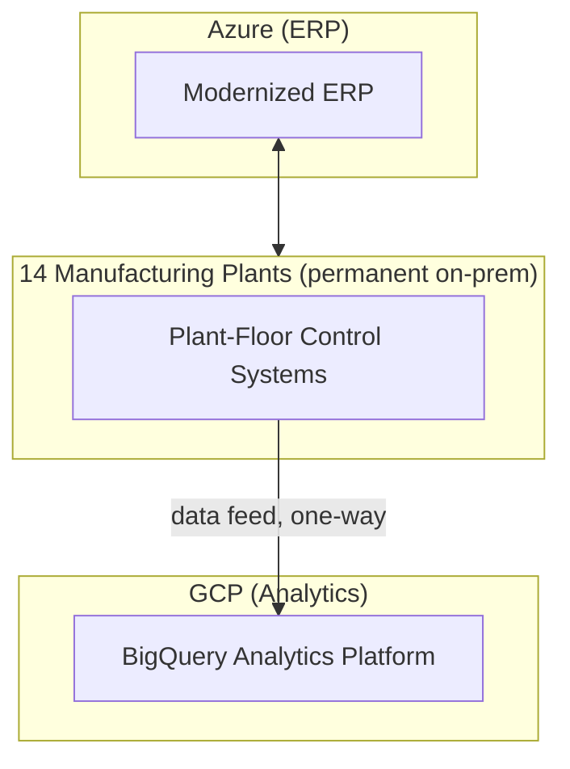

# Case Study: Manufacturing Company — Hybrid Cloud Strategy

## Overview

A manufacturing company with plant-floor control systems that have genuine, long-term regulatory and latency constraints against cloud migration adopted a deliberately permanent hybrid cloud architecture spanning on-prem, Azure, and GCP.

## Business Problem

Unlike organizations treating hybrid as a migration waypoint, this company's plant-floor control systems (real-time manufacturing equipment control) cannot move to the cloud for the foreseeable future — regulatory certification requirements and hard real-time latency constraints make it impractical. Meanwhile, their ERP modernization (Azure) and new data analytics platform (GCP) both genuinely benefited from cloud-native capabilities. The company needed a hybrid architecture designed as a permanent target state, not a temporary bridge.

## Current State

- On-prem plant-floor systems across 14 manufacturing facilities, each with local control systems
- A legacy on-prem ERP system mid-migration to Azure
- A newly initiated data analytics initiative targeting GCP for its BigQuery-based analytics capabilities

## Challenges

- Designing hybrid connectivity and identity federation for a genuinely permanent (not transitional) architecture
- Avoiding the common mistake of under-investing in hybrid infrastructure because it's assumed temporary (see `cloud-patterns/hybrid-cloud.md`)
- Coordinating IP address planning across on-prem, Azure, and GCP simultaneously, given the earlier IP overlap incident described in `architecture-domains/networking.md`'s real enterprise scenario (from this same company, during an unrelated acquisition)

## Architecture

The company implemented the composed hybrid cloud reference architecture (`reference-architectures/hybrid-cloud.md`): federated identity from their on-prem Active Directory to both Azure AD/Entra ID and GCP IAM, staged connectivity (HA VPN initially, migrating the higher-bandwidth GCP analytics link to Partner Interconnect after six months of measured traffic), and centrally planned, non-overlapping IP address space across all three environments.

## Migration Strategy

Deliberately partial: plant-floor control systems were explicitly designated permanent on-prem (not a migration candidate at all), ERP followed a standard replatform strategy to Azure, and the analytics platform was built cloud-native on GCP from the start (no migration, greenfield).

## Security

Identity federation extended Zero Trust principles (`cloud-patterns/zero-trust.md`) across all three environments — plant-floor system access, in particular, received the same identity-based verification as cloud access, rather than being treated as implicitly trusted "local" access.

## Governance

IP address planning was handled by a single, centrally owned spreadsheet-turned-source-of-truth process, learning directly from the earlier acquisition-related overlap incident — this time avoiding it entirely through proactive coordination across all three environments before any connectivity was built.

## Results

- Zero IP address overlap incidents in the hybrid build, a direct improvement over the earlier acquisition-related incident
- ERP modernization completed on Azure with hybrid connectivity to plant systems maintained throughout
- Analytics platform on GCP achieved sub-hour latency for plant-floor data ingestion via the one-way data feed, sufficient for the analytics use case without requiring plant systems themselves to be cloud-connected in real time

## Lessons Learned

- Treating hybrid as a genuinely permanent target state (not a migration waypoint) justified investment in redundant connectivity and thorough identity federation that a "temporary" framing would have deprioritized
- A prior painful incident (the IP overlap) became an effective internal case for proactive planning discipline on this project — sometimes the best argument for rigor is a specific, remembered past failure
- Different workloads (ERP vs. analytics vs. plant control) genuinely warranted different architectural treatment (migrate vs. build cloud-native vs. never migrate) rather than a uniform strategy

## Common Mistakes

This company specifically avoided the "temporary hybrid, so under-invest in it" mistake described in `cloud-patterns/hybrid-cloud.md`, having learned from their own prior IP-planning incident — a useful illustration that architectural discipline is often driven by direct institutional memory of past pain.

## Interview Questions

- "How would you design a hybrid architecture for a company with a genuinely permanent on-prem component?"
- "How do you plan non-overlapping IP address space across three separately-administered environments?"
- "What criteria would you use to decide a workload should never migrate to the cloud?"

## Summary

This manufacturing company's hybrid cloud strategy treats on-prem, Azure, and GCP as a permanent, coherently governed architecture rather than a migration waypoint — with workload-specific treatment (permanent on-prem, replatform, cloud-native greenfield) and proactive IP/identity planning informed directly by a prior painful integration incident.

## Further Reading

- `cloud-patterns/hybrid-cloud.md`
- `reference-architectures/hybrid-cloud.md`
- `architecture-domains/networking.md`
