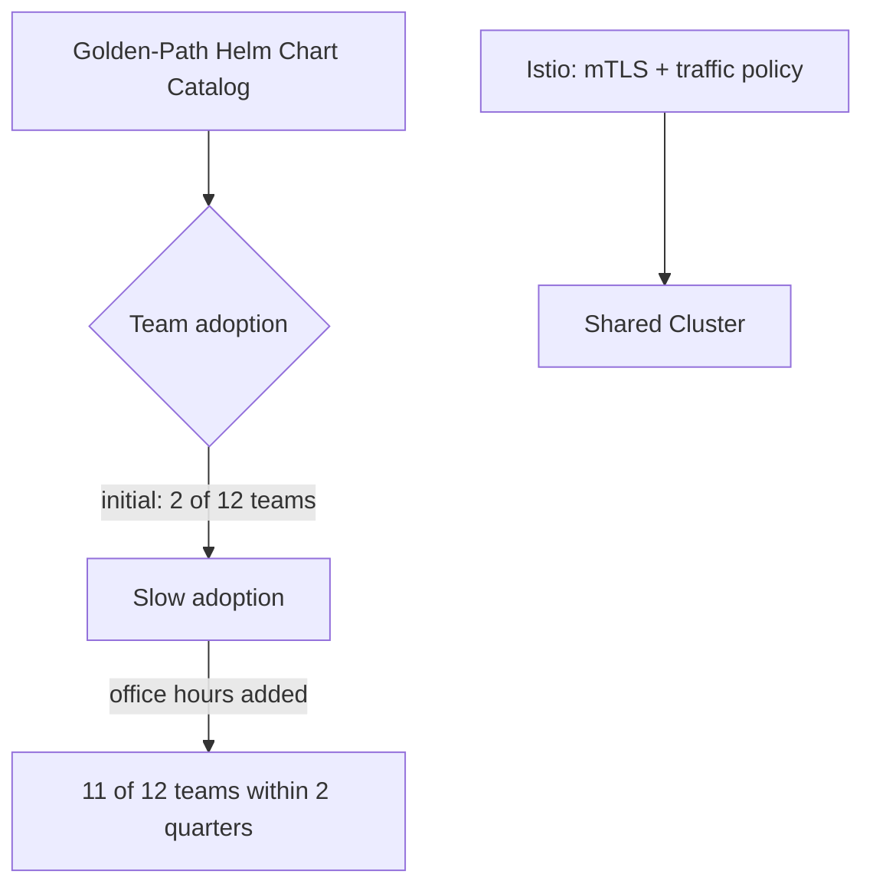

# Case Study: Media Company — Kubernetes Platform Adoption

## Overview

A media company running dozens of microservices adopted a multi-tenant Kubernetes platform, following the namespace-isolation-plus-golden-path pattern documented in `architecture-domains/kubernetes.md` and `reference-architectures/kubernetes-platform.md`.

## Business Problem

A dozen engineering teams were independently managing their own Kubernetes deployments with wildly inconsistent security scanning, resource limits, and observability wiring — some teams had none of the above. The platform team needed to consolidate onto a shared, governed model without simply mandating compliance and hoping for adoption.

## Current State

- A dozen teams, each running services on a shared but ungoverned cluster with no consistent RBAC, network policy, or CI/CD standard
- No service mesh; inconsistent, ad hoc service-to-service authentication
- Two teams had already begun independently evaluating Istio for their own needs

## Challenges

- Getting genuine adoption of a new golden-path model without a hard mandate (see `architecture-principles/platform-engineering.md`)
- Deciding on a multi-tenancy isolation boundary, particularly once one team's workloads (processing sensitive customer viewing data) raised a stronger isolation question
- Two teams' independent Istio evaluation needed to be consolidated into a single, platform-owned decision rather than allowed to fragment further

## Architecture

The platform team built a golden-path Helm chart catalog with CI/CD, observability, and default-deny network policy pre-wired (`architecture-domains/platform-engineering.md`), adopted namespace-based multi-tenancy for most workloads, and adopted Istio organization-wide — primarily for its mTLS and fine-grained traffic policy, consistent with `cloud-patterns/mesh-network.md`'s framing that identity-based security, not the mesh topology itself, was the actual driver.

## Migration Strategy

Adoption was voluntary but actively supported — the platform team ran weekly office hours for the first quarter specifically to reduce the friction of switching from a bespoke setup to the golden path, having initially assumed the tooling alone would be enough to drive adoption. It wasn't, until human support was added (see `architecture-principles/platform-engineering.md`'s real enterprise scenario, drawn from this same initiative).

## Security

Istio's mTLS gave every service-to-service call cryptographic identity verification, replacing inconsistent, ad hoc authentication approaches across the dozen teams — a concrete instance of `cloud-patterns/zero-trust.md`'s principle applied at the service-mesh layer.

## Governance

Default-deny network policy, group-based RBAC, and resource quotas were baked into the golden-path catalog by default — teams adopting the catalog got these controls automatically, without needing to understand or configure them individually.

## Results

- Golden-path catalog adoption grew from 2 of 12 teams to 11 of 12 within two quarters, once office-hours support was added alongside the self-service tooling
- Security scanning coverage went from partial/inconsistent to comprehensive across all adopting teams
- The one holdout team had a genuinely unusual requirement (a stateful, non-standard workload) that warranted a documented escape-hatch exception rather than forced golden-path adoption

## Lessons Learned

- Self-service tooling alone was insufficient to drive adoption — the human support layer (office hours) was what actually moved the adoption curve, a finding consistent with this repository's broader platform engineering principle that a platform is a product requiring product-management effort, not just technical capability
- Consolidating two teams' independent Istio evaluations into one platform-owned decision avoided the fragmentation risk of multiple, incompatible service mesh adoptions
- The one legitimate holdout validated the importance of a genuine escape hatch (`architecture-domains/platform-engineering.md`) rather than a hard mandate that would have forced an awkward, unsafe fit

## Common Mistakes

The platform team's own initial mistake — assuming tooling alone drives adoption — is directly documented as a common mistake in `architecture-principles/platform-engineering.md`, drawn from this case study's own experience.

## Interview Questions

- "How would you drive adoption of a new internal platform beyond just building good tooling?"
- "How do you handle a team with a genuinely legitimate reason to deviate from the golden path?"
- "What specifically does a service mesh solve that plain Kubernetes networking doesn't?"

## Summary

This media company's Kubernetes platform adoption succeeded once the platform team recognized that self-service tooling alone wasn't sufficient — pairing the golden-path catalog with active office-hours support drove adoption from 2 to 11 of 12 teams, while a documented escape hatch handled the one genuinely unusual workload appropriately.

## Further Reading

- `architecture-principles/platform-engineering.md`, `architecture-domains/platform-engineering.md`
- `reference-architectures/kubernetes-platform.md`
- `cloud-patterns/mesh-network.md`
