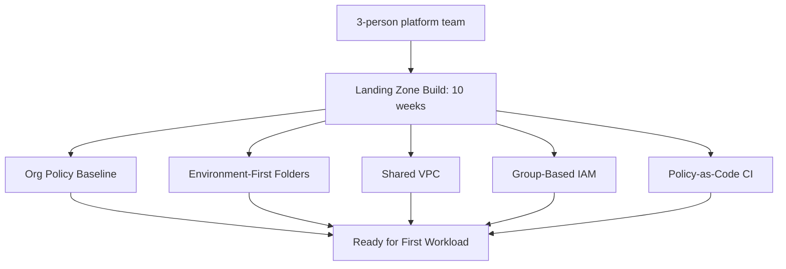

# Case Study: Financial Services Company — Landing Zone Implementation

## Overview

A mid-size financial services company built a GCP landing zone from scratch, following the environment-first pattern detailed in `cloud-patterns/landing-zone.md` and the companion `gcp-landing-zone` repository, as the foundation for a multi-year cloud strategy.

## Business Problem

The company needed a compliant, auditable cloud foundation before any workload — particularly anything touching customer financial data — could be deployed. Regulatory requirements (data residency, access auditability) made "build governance first" non-negotiable, unlike Northwind Retail's time-pressured scenario in `case-studies/enterprise-modernization.md`.

## Current State

Greenfield — no existing cloud presence, giving the platform team the (relatively rare) luxury of building the landing zone before any workload pressure existed.

## Challenges

- Regulatory requirements (data residency, comprehensive audit logging) needed to be structurally guaranteed, not just documented as policy
- The platform team was small (three engineers) relative to the governance scope required
- Business stakeholders were eager to start building workloads immediately and needed convincing that landing zone investment came first

## Architecture

The team implemented the environment-first folder hierarchy (ADR-001), Shared VPC networking (ADR-002), group-based IAM (ADR-003), and policy-as-code enforcement (ADR-005) exactly as documented in this repository's ADRs — this case study is, in effect, the narrative behind those decisions.

## Migration Strategy

Not applicable in the traditional sense — this was a greenfield build, not a migration. The relevant sequencing decision was which workload landed first: a low-stakes internal tool (not customer-facing, not regulatory-scoped) was deliberately chosen as the first tenant, to validate the landing zone under real (but low-risk) usage before onboarding the higher-stakes Payments workload.

## Security

Org Policy constraints (disable service account key creation, deny external IPs by default, restrict resource locations to satisfy data residency) were set at the organization node from day one — see `architecture-decision-records/adr-001-landing-zone.md` and the companion `gcp-landing-zone` repository's `docs/02-organization-structure.md`.

## Governance

Policy-as-code (ADR-005) was implemented from the very first Terraform PR, not retrofitted — a genuine advantage of the greenfield context versus Northwind Retail's retrofit scenario.

## Results

- Landing zone core build (org policy, folders, Shared VPC, IAM baseline, CI policy gate) completed in 10 weeks with a 3-person team
- First (low-stakes) workload onboarded in week 11; the regulatory-scoped Payments workload onboarded in week 18, after the low-stakes workload validated the platform
- Zero manual console changes to production infrastructure in the first year — every change flowed through the reviewed, policy-gated Terraform pipeline

## Lessons Learned

- A small platform team (3 engineers) can build a complete landing zone core in about 10 weeks if focused, but this required deliberately deferring less-critical scope (the AI platform and Kubernetes platform work came later, as separate initiatives — see `reference-architectures/ai-platform.md` and `kubernetes-platform.md`)
- Onboarding a deliberately low-stakes workload first, before the highest-stakes one, surfaced platform gaps (a missing IAM role, an overly strict Org Policy constraint) under low-risk conditions
- Greenfield governance-first sequencing, while ideal, still required active stakeholder management to hold the line against pressure to start building workloads sooner

## Common Mistakes

The team avoided most of the common mistakes catalogued in `cloud-patterns/landing-zone.md` specifically because of the greenfield context and small, focused team — the primary mistake risk they identified retrospectively was nearly under-scoping the initial policy-as-code investment (ADR-005) to save time, which they're glad they didn't do given how central it became to their zero-manual-change track record.

## Interview Questions

- "How would you sequence a greenfield landing zone build with a small team?"
- "Why might you deliberately onboard a low-stakes workload before your highest-priority one?"
- "How do you hold the line on governance-first sequencing against stakeholder pressure to move faster?"

## Summary

This financial services company's greenfield landing zone build validated the environment-first, policy-as-code-from-day-one approach documented across this repository's ADRs, completing a production-ready core foundation in 10 weeks with a small team by deliberately sequencing a low-stakes workload before the regulatory-scoped one.

## Further Reading

- `cloud-patterns/landing-zone.md`
- `architecture-decision-records/adr-001` through `adr-005`
- Companion repository: `gcp-landing-zone`
