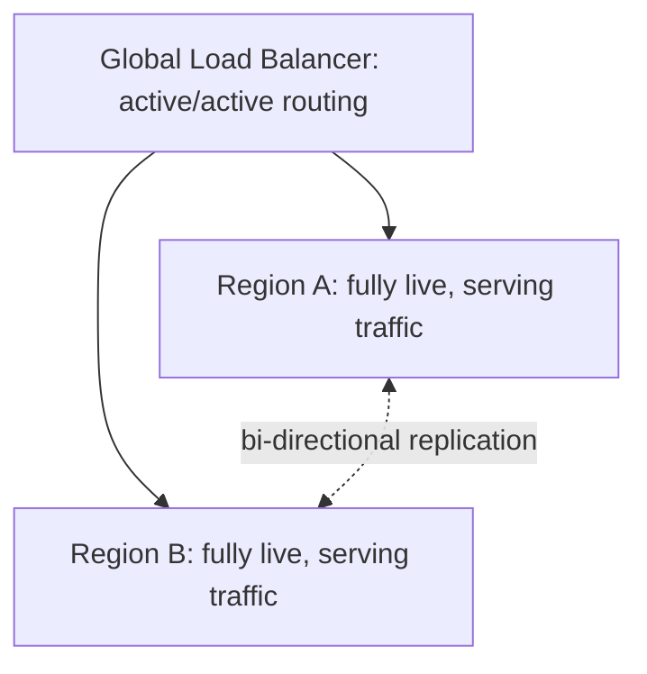

# Active-Active Architecture

## Overview

Active-active runs identical, fully functional infrastructure in two or more regions simultaneously, with traffic distributed across all of them under normal operation — not just held in reserve for failover. It's the more demanding, more resilient sibling of active-passive.

## Business Problem

Active-passive's standby region sits mostly idle, representing pure cost with no throughput or latency benefit until a failover event. Active-active eliminates that idle cost by using every region's capacity all the time — at the cost of a much harder consistency problem.

## Architecture

## Design Decisions

- Active-active is only adopted when the data layer can support **bi-directional replication with an acceptable conflict resolution strategy** — this is usually the actual gating factor, not the compute/application tier, which is often stateless and trivially active-active-capable.
- Traffic routing uses geo-proximity or latency-based routing across all active regions, not a primary/secondary designation.

## Decision Trade-offs

| Choice | Trade-off |
|---|---|
| Active-active over active-passive | No idle standby cost, better latency for distributed users, faster failover (already serving traffic); requires solving bi-directional data consistency, which is genuinely hard |
| Active-active over single-region | Higher resilience and better global latency; roughly doubles (or more) infrastructure cost with no idle capacity to "save" the way active-passive superficially seems to |

## Advantages

- No idle standby capacity — every region's infrastructure investment is fully utilized
- Faster failover than active-passive, since the surviving region is already serving live traffic, not cold-starting
- Better baseline latency for geographically distributed users, all the time, not just during a failover

## Disadvantages

- Requires solving distributed data consistency and conflict resolution, which is a genuinely hard, easy-to-get-wrong problem (see CAP theorem trade-offs)
- Testing is harder — issues only reproducible under true multi-writer conditions won't surface in single-region testing
- Not every data store or workload architecture supports bi-directional replication cleanly; retrofitting an existing single-writer system for active-active is a significant undertaking

## Security Considerations

Multi-writer data stores expand the attack surface for data integrity issues — a compromised credential in one region can now write conflicting or malicious data that propagates to every other active region, which argues for strong write-path authorization independent of region.

## Operational Considerations

Active-active requires operational maturity to debug — a data inconsistency issue could originate from either region's write path, and reproducing it requires understanding both the replication mechanism and conflict resolution logic, not just one region's behavior in isolation.

## Cost Considerations

While there's no "idle" standby cost, active-active is not necessarily cheaper than active-passive in aggregate — both regions run at production scale continuously, versus active-passive's standby potentially running at reduced capacity.

## Scalability

Active-active scales global user bases well, since capacity grows with the number of active regions rather than being capped by a single active region's ceiling — but each additional region adds another node to the data consistency problem.

## Availability

This pattern offers the strongest availability characteristics in this repository's pattern set, provided the data layer's conflict resolution behavior is well-understood and tested — an untested conflict resolution strategy can silently corrupt data during exactly the high-traffic, high-stress conditions where it matters most.

## Real Enterprise Scenario

A global media streaming platform adopted active-active for its content catalog service (largely read-heavy, eventually-consistent-tolerant) but deliberately kept its billing/payment service active-passive — a clear example of applying different multi-region patterns to different workloads within the same platform based on each workload's actual consistency requirements, rather than picking one pattern organization-wide.

## Common Mistakes

- Adopting active-active for a workload with strong consistency requirements (e.g., financial transactions) without a genuinely sound conflict resolution strategy.
- Assuming active-active is unconditionally "better" than active-passive and applying it uniformly instead of workload-by-workload.
- Under-testing multi-writer conflict scenarios until they occur in production.

## Interview Questions

- "How would you decide between active-active and active-passive for a given workload?"
- "How do you handle write conflicts in an active-active data layer?"
- "What workload characteristics make active-active a poor fit?"

## Summary

Active-active runs fully live infrastructure in multiple regions simultaneously, eliminating idle standby cost and improving both latency and failover speed, at the cost of a genuinely hard bi-directional data consistency problem — best suited to workloads whose data layer tolerates eventual consistency or multi-writer conflict resolution well.

## Further Reading

- `cloud-patterns/active-passive.md`, `cloud-patterns/multi-region.md`
- `architecture-domains/disaster-recovery.md`
