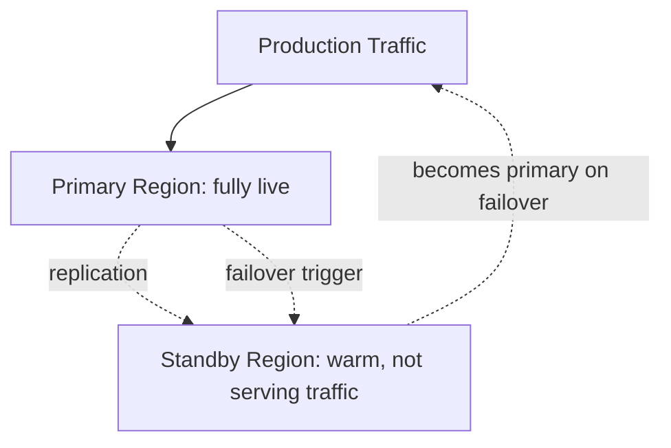

# Active-Passive Architecture

## Overview

Active-passive keeps a fully functional standby environment in a secondary region, not serving production traffic under normal conditions, ready to take over if the primary region fails. It's the more conservative, easier-to-reason-about sibling of active-active.

## Business Problem

Many workloads have real resilience requirements (survive a regional outage) but data or application architectures that don't cleanly support multi-writer, bi-directional replication. Active-passive delivers regional resilience without requiring the organization to solve active-active's harder consistency problem.

## Architecture

## Design Decisions

- Standby is kept **warm** (infrastructure provisioned and data replicated, but not serving traffic) rather than **cold** (provisioned on-demand during failover) whenever the RTO target requires faster-than-provisioning-time recovery — see `architecture-domains/disaster-recovery.md` for how RTO/RPO targets drive this choice.
- Replication to the standby is typically asynchronous, accepting a bounded RPO (potential data loss window) in exchange for not impacting primary-region write latency.
- Failover is a deliberate, tested, and ideally partially automated procedure — not a purely manual, ad hoc response improvised during an actual incident.

## Decision Trade-offs

| Choice | Trade-off |
|---|---|
| Warm standby | Fast failover (minutes); ongoing cost for idle-but-provisioned standby infrastructure |
| Cold standby | Minimal ongoing cost; slow failover (provisioning time added to RTO), unsuitable for tight RTO targets |
| Active-passive over active-active | Simpler consistency model (single writer); standby capacity sits idle under normal operation |

## Advantages

- Simpler data consistency model than active-active — a single writer at any given time avoids multi-writer conflict resolution entirely
- Easier to reason about and test than active-active's distributed consistency challenges
- Suitable for workloads with strong consistency requirements that can't tolerate active-active's eventual-consistency trade-offs

## Disadvantages

- Standby capacity is largely idle under normal operation — a real, ongoing cost with no throughput or latency benefit until failover
- Failover itself introduces risk — DNS propagation delays, replication lag at the moment of failure, and untested procedures are common sources of a failover taking longer or losing more data than planned
- RPO is bounded by replication lag, which for asynchronous replication means some data loss during failover is a designed-in possibility, not a bug

## Security Considerations

The standby region needs the same security posture (IAM, network segmentation, patching) as the primary at all times — a standby that's fallen out of sync security-wise becomes a liability the moment it's promoted to primary during an actual incident.

## Operational Considerations

Regular, realistic failover drills are the single highest-leverage investment for active-passive reliability — a failover procedure that's never been tested end-to-end frequently reveals gaps (stale runbooks, forgotten manual steps, DNS TTLs set too high) exactly when there's no time to discover them.

## Cost Considerations

Standby infrastructure cost can sometimes be reduced (smaller instance sizes, reduced replica counts) versus full production capacity, provided the design explicitly accounts for the scale-up time this introduces into the RTO.

## Scalability

Active-passive scales to more than two regions (primary plus multiple standbys in different geographies) for organizations with very strict resilience requirements, though this multiplies both cost and replication complexity.

## Availability

Active-passive's availability characteristic is bounded by RTO (how long failover takes) and RPO (how much data can be lost) — both of which should be explicit, tested numbers, not aspirational ones. See `architecture-domains/disaster-recovery.md`.

## Real Enterprise Scenario

A healthcare company's patient records system used active-passive with a warm standby specifically because their data layer's consistency requirements (a single, authoritative record per patient) made active-active's conflict resolution risk unacceptable for a regulated healthcare context — a case where the "simpler" pattern was the correct architectural choice, not a compromise.

## Common Mistakes

- Provisioning a warm standby but never testing failover, discovering gaps only during a real incident.
- Setting DNS TTLs too high, adding unplanned minutes to failover time regardless of how fast the infrastructure itself fails over.
- Letting the standby region's configuration drift from primary (different patch levels, different IAM bindings) between drills.

## Interview Questions

- "How do you decide on warm versus cold standby for a given RTO target?"
- "Walk me through how you'd test a failover procedure without disrupting production."
- "What's the relationship between RPO and your replication strategy?"

## Summary

Active-passive keeps a standby region ready to take over from a failed primary, trading idle standby cost and failover-time risk for a much simpler single-writer data consistency model than active-active — well suited to workloads whose consistency requirements can't tolerate active-active's trade-offs.

## Further Reading

- `cloud-patterns/active-active.md`, `cloud-patterns/multi-region.md`
- `architecture-domains/disaster-recovery.md`
