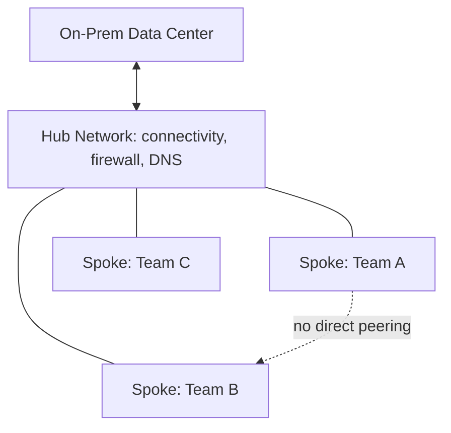

# Hub-and-Spoke Network Topology

## Overview

Hub-and-spoke centralizes shared network services (connectivity, firewalling, DNS) in a single "hub" network, while individual workload networks ("spokes") peer only to the hub, not to each other directly. It's the default enterprise network topology for a reason: it maps cleanly onto centralized network governance.

## Business Problem

Without a shared topology, every team building its own network reinvents connectivity to on-prem, duplicates NAT/DNS/firewall infrastructure, and creates N-squared complexity if teams eventually need to reach each other. Hub-and-spoke solves this by making the hub the single place connectivity, inspection, and shared services live.

## Architecture

## Design Decisions

- Spokes peer **only** to the hub, never to each other, by default — cross-spoke traffic is a deliberate, reviewed exception (routed through the hub, inspected), not an ambient capability.
- The hub owns connectivity (VPN/Interconnect equivalents), centralized firewall policy, and shared DNS — nothing workload-specific lives in the hub.
- This is functionally the same pattern as the Shared VPC design in the companion `gcp-landing-zone` repository, described here at the topology level independent of any single cloud's implementation.

## Decision Trade-offs

| Choice | Trade-off |
|---|---|
| Hub-and-spoke over full mesh | Simpler governance and inspection; requires the hub as a deliberate bottleneck/chokepoint for cross-spoke traffic |
| Hub-and-spoke over flat/shared network | Cleaner isolation per spoke; more networking objects to manage (one spoke per team/workload) |

## Advantages

- Single place to enforce firewall policy, inspect traffic, and manage connectivity to on-prem
- Spokes are cheap to add — new team, new spoke, no cross-team coordination required for basic connectivity
- Scales network governance without scaling the size of the networking team proportionally

## Disadvantages

- The hub becomes a genuine bottleneck for cross-spoke traffic bandwidth, and a single point of failure if not built with redundancy
- Spoke-to-spoke traffic requires explicit routing through the hub, adding latency and complexity versus direct peering for workloads that legitimately need to talk to each other frequently

## Security Considerations

Centralizing firewall policy and traffic inspection in the hub is this pattern's primary security value — see `architecture-domains/networking.md` and `cloud-patterns/zero-trust.md` for how hub-based inspection composes with identity-based access controls rather than relying on network location alone as a trust signal.

## Operational Considerations

The team owning the hub becomes an operational dependency for every spoke — hub outages or misconfigurations have organization-wide blast radius, which argues for treating the hub with Tier-0 operational rigor (change review, redundancy, monitoring).

## Cost Considerations

Centralizing NAT gateways, VPN/Interconnect capacity, and DNS in the hub is typically cheaper than each spoke provisioning its own — but the hub's redundancy requirements (multi-zone NAT, HA VPN) are a real, sometimes underestimated cost.

## Scalability

Scales well to dozens or hundreds of spokes; at very high spoke counts, some organizations introduce a second hub (regional hub-and-spoke, or a hub-of-hubs) to keep any single hub's blast radius and connection count manageable — see `cloud-patterns/multi-region.md`.

## Availability

Hub redundancy (multi-zone deployment of NAT/firewall/VPN resources) is essential — a single-zone hub failure taking down every spoke's connectivity is a common, avoidable incident.

## Real Enterprise Scenario

A retail company's dozen business units each maintained separate connectivity to the same on-prem data center before consolidating onto a hub-and-spoke model. The consolidation cut their total NAT/VPN infrastructure by roughly 80% and, more importantly, gave the security team a single place to deploy a next-generation firewall for east-west inspection — something that had been technically infeasible to deploy consistently across a dozen independent networks.

## Common Mistakes

- Allowing ad hoc spoke-to-spoke peering exceptions to accumulate until the topology is effectively a mesh with extra steps, losing the governance benefit.
- Under-provisioning hub redundancy, creating a single point of failure for the entire estate's connectivity.
- Treating the hub as a place for shared workloads (not just shared services), reintroducing workload/infrastructure coupling this pattern exists to avoid.

## Interview Questions

- "When would you choose hub-and-spoke over a mesh topology?"
- "How do you handle a legitimate need for two spokes to communicate frequently and with low latency?"
- "How would you scale hub-and-spoke past a single region?"

## Summary

Hub-and-spoke centralizes shared network services and governance in a hub, with spokes peering only to the hub by default — trading some cross-spoke latency and hub-dependency risk for dramatically simpler, centrally enforceable network governance.

## Further Reading

- `cloud-patterns/mesh-network.md`, `cloud-patterns/shared-services.md`, `cloud-patterns/multi-region.md`
- `architecture-domains/networking.md`
- `diagrams/hub-spoke.drawio`
