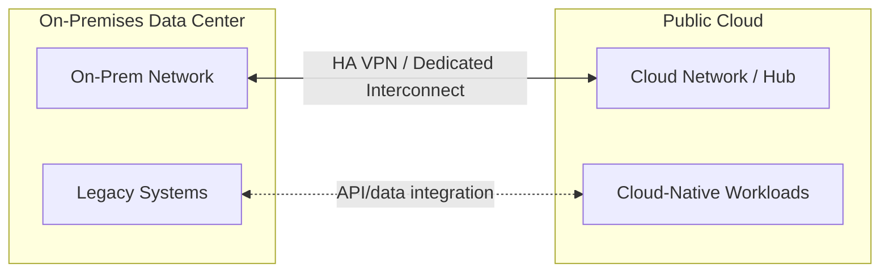

# Hybrid Cloud Architecture

## Overview

Hybrid cloud combines on-premises infrastructure with one or more public clouds into a single, coherently governed architecture — distinct from multi-cloud (multiple public clouds), though the two are frequently combined and sometimes conflated.

## Business Problem

Few enterprises move to the cloud in a single event — data center leases, regulatory constraints, latency-sensitive on-prem systems, and simple migration sequencing mean most organizations operate a genuine hybrid estate for years, sometimes indefinitely. Hybrid cloud architecture treats this as a deliberate, first-class design target rather than a temporary, "in-progress migration" state to be tolerated.

## Architecture

## Design Decisions

- Hybrid connectivity is staged: HA VPN first for fast time-to-connectivity, Dedicated/Partner Interconnect once bandwidth or latency requirements justify it — see the companion `gcp-landing-zone` repository's `docs/10-hybrid-connectivity.md` for the concrete implementation of this staging.
- On-prem and cloud IP address spaces are planned to **never overlap**, decided before the first connection is built — a foundational constraint that's expensive to fix retroactively.
- Identity is federated (a single identity provider spanning on-prem and cloud) rather than maintained as separate, unsynchronized identity stores — see `architecture-domains/identity.md`.

## Decision Trade-offs

| Choice | Trade-off |
|---|---|
| Hybrid cloud as a deliberate target state | Clear governance and connectivity model even for long-lived hybrid estates; requires investment in connectivity/identity federation many treat as "temporary" and underinvest in |
| HA VPN over Interconnect initially | Fast, low-commitment connectivity; internet-transiting, more variable latency than a dedicated circuit |

## Advantages

- Avoids the false choice of "migrate everything immediately" versus "cloud is blocked until everything can move"
- Lets latency-sensitive or regulation-bound systems remain on-prem while genuinely cloud-native workloads move
- Federated identity and consistent networking give a unified security and operational model across both environments

## Disadvantages

- Operating two environments (on-prem and cloud) simultaneously is genuinely more complex than either alone — different tooling, different failure modes, different teams historically
- Hybrid connectivity is a single point of failure for any workload depending on both sides unless deliberately built redundant
- "Temporary" hybrid states have a strong tendency to become permanent, and under-investment predicated on that temporariness compounds over years

## Security Considerations

Hybrid connectivity extends the enterprise's network trust boundary into the cloud — traffic arriving over a VPN/Interconnect tunnel should not be implicitly trusted as "internal" without the same Zero Trust-style verification applied to any other traffic. See `cloud-patterns/zero-trust.md`.

## Operational Considerations

Hybrid environments benefit enormously from a single, federated identity provider and consistent observability tooling spanning both sides — operating two completely disjoint operational toolchains is a common, expensive failure mode.

## Cost Considerations

Dedicated Interconnect has meaningful fixed cost and provisioning lead time that should be justified by actual bandwidth/latency needs, not adopted preemptively "because it's more enterprise" — HA VPN is often sufficient for years.

## Scalability

Hybrid architectures scale by adding connectivity capacity (additional VPN tunnels, higher-bandwidth Interconnect) and by extending the landing zone pattern's governance model to cover both environments consistently.

## Availability

Connectivity between on-prem and cloud should be built redundantly (multiple tunnels/circuits, ideally across independent paths) for any workload where hybrid connectivity failure would be a business-impacting event.

## Real Enterprise Scenario

A manufacturing company maintained a genuinely permanent hybrid architecture — certain plant-floor control systems have regulatory and latency requirements that make cloud migration impractical for the foreseeable future — and designed their landing zone's identity and networking model explicitly to treat this as a permanent target state rather than a migration waypoint. See `case-studies/hybrid-cloud-strategy.md`.

## Common Mistakes

- Treating hybrid cloud as a temporary state and under-investing in connectivity resilience and identity federation as a result.
- Allowing on-prem and cloud IP ranges to overlap, discovered only when BGP routing conflicts surface.
- Failing to extend consistent security/observability tooling to the on-prem side, creating a visibility gap.

## Interview Questions

- "How do you decide what stays on-prem versus what moves to the cloud?"
- "What's your approach to identity federation across on-prem and cloud?"
- "How would you design redundant hybrid connectivity?"

## Summary

Hybrid cloud deliberately architects for a long-lived (sometimes permanent) combination of on-prem and cloud infrastructure — with staged connectivity, non-overlapping IP planning, and federated identity as the foundational decisions — rather than treating it as a temporary migration waypoint.

## Further Reading

- Companion repository: `gcp-landing-zone`, `docs/10-hybrid-connectivity.md`
- `cloud-patterns/zero-trust.md`
- `reference-architectures/hybrid-cloud.md`
- `diagrams/hybrid-cloud.drawio`
