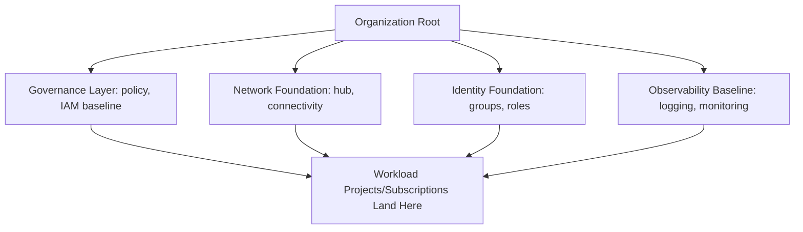

# Landing Zone

## Overview

A landing zone is the pre-provisioned organizational, network, identity, and governance foundation that every workload "lands" into. It's the single most consequential pattern in this repository, because nearly every other pattern and reference architecture assumes one already exists.

## Business Problem

Without a landing zone, every team provisions infrastructure ad hoc — inconsistent naming, ungoverned IAM, duplicated networking, no consistent logging baseline — and retrofitting governance onto an established, sprawling estate is dramatically more expensive than building it first. See `architecture-principles/cloud-adoption-framework.md`.

## Architecture

## Design Decisions

- Governance, network, identity, and observability foundations are provisioned **before** the first workload, not incrementally alongside it — see the companion `gcp-landing-zone` repository for a complete, concrete implementation of this pattern.
- A landing zone is **owned by a platform team as an ongoing product**, not a one-time setup project — see `architecture-principles/platform-engineering.md`.

## Decision Trade-offs

| Choice | Trade-off |
|---|---|
| Landing zone before workload migration | Slower initial time-to-first-workload; governance and security are structural, not retrofitted |
| Minimal landing zone, expand later | Faster initial wins; real risk the "later" expansion never happens under ongoing delivery pressure |

## Advantages

- Every workload inherits consistent security, networking, and governance without per-team effort
- Dramatically reduces the "cloud sprawl" failure mode
- Creates a single, auditable foundation for compliance and security review

## Disadvantages

- Requires real upfront investment and a dedicated platform team commitment before any workload value is delivered
- Can become a bottleneck if the platform team doesn't invest in genuine self-service (see `architecture-principles/platform-engineering.md`)

## Security Considerations

The landing zone is the highest-leverage place to enforce security controls — org policy, IAM baseline, network segmentation set here apply to every workload automatically. See `architecture-domains/security.md` and `architecture-domains/governance.md`.

## Operational Considerations

Landing zone ownership needs to be a clearly staffed, ongoing responsibility — not a project that "finishes" and gets deprioritized, since new cloud capabilities and evolving compliance requirements mean the landing zone keeps changing.

## Cost Considerations

Centralizing shared infrastructure (networking, logging) in the landing zone is typically cheaper in aggregate than per-team duplication, though the platform team's own cost needs to be budgeted as genuine, ongoing infrastructure investment.

## Scalability

A well-designed landing zone (see `cloud-patterns/shared-services.md`, `cloud-patterns/hub-spoke.md`) scales from a handful of workload teams to hundreds without structural redesign — only the depth of automation and self-service tooling needs to grow.

## Availability

The landing zone's shared components (network hub, identity, logging) become availability-critical dependencies for every workload — see `cloud-patterns/hub-spoke.md` for hub redundancy considerations.

## Real Enterprise Scenario

See `case-studies/landing-zone-implementation.md` for a complete, real-world-modeled narrative of a landing zone build, including the organizational negotiation required to get workload teams to actually migrate onto it rather than continuing ungoverned parallel provisioning.

## Common Mistakes

- Treating landing zone construction as a one-time project rather than an ongoing platform.
- Building a landing zone with no self-service path, turning the platform team into a provisioning bottleneck.
- Over-engineering the initial landing zone for a scale the organization won't reach for years, delaying time-to-value.

## Interview Questions

- "What's the minimum viable landing zone for a 50-person engineering organization?"
- "How do you get existing, ungoverned workloads to migrate onto a newly built landing zone?"
- "What's the difference between a landing zone and a reference architecture?"

## Summary

A landing zone is the governed foundation — organization structure, network, identity, observability — that every workload lands into, built before workload migration and owned as an ongoing platform rather than a one-time project.

## Further Reading

- Companion repository: `gcp-landing-zone` (complete Terraform implementation)
- `cloud-patterns/shared-services.md`, `cloud-patterns/hub-spoke.md`
- `case-studies/landing-zone-implementation.md`
- `diagrams/landing-zone.drawio`
