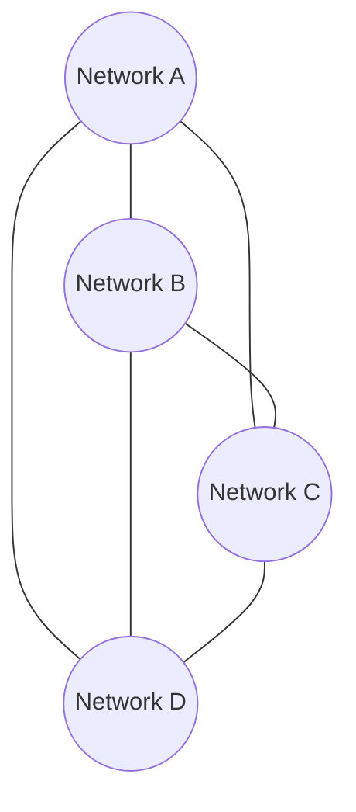

# Mesh Network Topology

## Overview

A mesh network topology connects every network directly to every other network it needs to reach, rather than routing through a central hub. At the application layer, this pattern is more commonly seen today as a **service mesh** (Istio, Linkerd) governing service-to-service traffic within and across clusters — this document covers both the network-level and service-mesh expressions of the pattern.

## Business Problem

Hub-and-spoke's chokepoint becomes a genuine constraint when many workloads need frequent, low-latency, high-bandwidth communication with each other — routing everything through a central hub adds latency and concentrates bandwidth demand on infrastructure that wasn't sized for workload-to-workload traffic.

## Architecture

## Design Decisions

- Full mesh (every node peered to every other) is used sparingly, typically only among a small number of "peer" networks (e.g., a handful of regional hubs) — full mesh at workload scale is avoided in favor of a service mesh operating at the application layer instead.
- A **service mesh** (sidecar-based or ambient) is the preferred mechanism for workload-to-workload mesh connectivity within Kubernetes, because it adds identity-based mTLS and fine-grained traffic policy that a pure network-layer mesh can't provide.

## Decision Trade-offs

| Choice | Trade-off |
|---|---|
| Network-level mesh over hub-and-spoke | Lower latency, no hub bottleneck; N² peering relationships to manage and secure |
| Service mesh over network-level mesh for workload traffic | Identity-based policy and mTLS, works across network boundaries; adds sidecar/proxy operational overhead and a genuine learning curve |

## Advantages

- Eliminates the hub as a bandwidth and latency bottleneck for peer-to-peer traffic
- Service mesh specifically adds strong identity-based security (mTLS, fine-grained authorization) independent of network topology
- No single point of failure for connectivity between meshed networks

## Disadvantages

- Network-level mesh peering relationships grow quadratically with the number of networks, becoming unmanageable past a small number of peers
- No natural chokepoint for centralized traffic inspection, unlike hub-and-spoke — security teams lose an easy place to deploy inspection
- Service mesh adds real operational complexity (sidecar resource overhead, control plane to operate, debugging an extra network hop)

## Security Considerations

Service mesh's mTLS and identity-based authorization is a genuine security upgrade over network-location-based trust — see `cloud-patterns/zero-trust.md` — but a network-level full mesh without equivalent identity controls can actually **weaken** security posture by removing the hub's natural inspection point without replacing it with anything.

## Operational Considerations

Service mesh adoption should follow the "team has the operational capacity" principle from `architecture-principles/design-principles.md` — a small platform team adopting a full-featured service mesh before they're ready for its operational surface area is a common, costly mistake.

## Cost Considerations

Network-level mesh peering has minimal direct cost but real complexity cost; service mesh sidecars add real compute overhead per pod (CPU/memory for the proxy) that should be budgeted explicitly at scale.

## Scalability

Network-level full mesh does not scale past roughly a dozen peer networks without becoming unmanageable; service mesh scales well to hundreds of services but the control plane itself needs to be sized and, at very large scale, potentially federated.

## Availability

Mesh topologies (network or service) generally improve availability versus hub-and-spoke for peer-to-peer traffic, since there's no single hub whose failure takes down all connectivity — though a service mesh's control plane becomes its own availability-critical component.

## Real Enterprise Scenario

A media company running dozens of microservices on Kubernetes adopted Istio primarily for mTLS and fine-grained traffic policy between services processing sensitive customer data, not primarily for the mesh topology itself — the identity-based security model was the actual driver, with the mesh's traffic-shaping capabilities (canary releases, circuit breaking) as a secondary benefit realized later. See `case-studies/kubernetes-adoption.md`.

## Common Mistakes

- Adopting a full network-level mesh at workload scale instead of hub-and-spoke plus a service mesh at the application layer, hitting N² management complexity.
- Adopting a service mesh purely because it's considered "modern," without a specific problem (mTLS requirement, fine-grained traffic policy) driving the decision.
- Underestimating service mesh sidecar resource overhead when budgeting cluster capacity.

## Interview Questions

- "When does a mesh topology make more sense than hub-and-spoke?"
- "What specific problem does a service mesh solve that ordinary Kubernetes networking doesn't?"
- "How would you decide whether your team is ready to adopt a service mesh?"

## Summary

Mesh topologies trade hub-and-spoke's centralized chokepoint for direct, low-latency peer connectivity — valuable for a small number of peer networks or, more commonly today, expressed as a service mesh providing identity-based security and traffic policy at the application layer within Kubernetes.

## Further Reading

- `cloud-patterns/hub-spoke.md`, `cloud-patterns/zero-trust.md`
- `architecture-domains/kubernetes.md`, `architecture-domains/networking.md`
