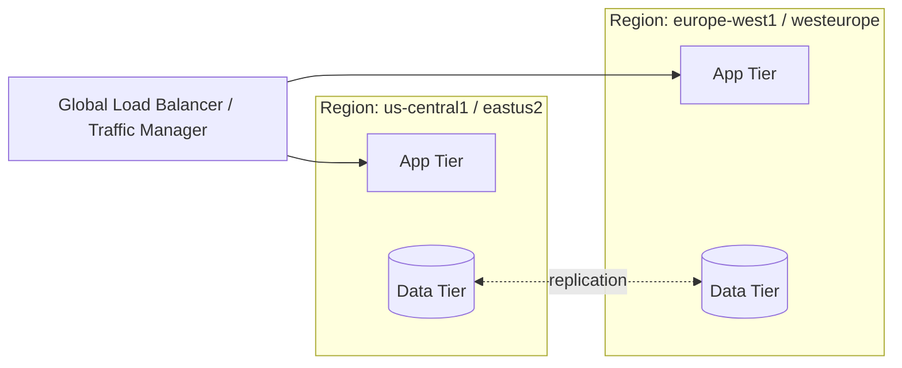

# Multi-Region Architecture

## Overview

Multi-region architecture distributes infrastructure across two or more geographic regions, for reasons ranging from latency (serving users closer to where they are) to resilience (surviving a full regional outage) to regulatory data residency requirements.

## Business Problem

A single-region architecture has a hard ceiling on both latency for geographically distributed users and resilience against regional-scale failures (which, while rare, do happen to every major cloud provider). Multi-region trades cost and complexity for headroom against both.

## Architecture

## Design Decisions

- The specific multi-region *pattern* (active-active vs. active-passive) is a separate decision — see `cloud-patterns/active-active.md` and `cloud-patterns/active-passive.md` — this document covers the shared architectural concerns common to both.
- Data replication strategy (synchronous vs. asynchronous, and its consistency implications) is decided **before** the region topology, not after — it constrains what's achievable, not the reverse.
- Multi-region is adopted only when a specific, stated business requirement (latency SLA, RTO/RPO target, data residency law) demands it — not by default, because of the real cost and complexity involved.

## Decision Trade-offs

| Choice | Trade-off |
|---|---|
| Multi-region over single-region | Resilience to regional failure, lower latency for distributed users; roughly 1.5-3x infrastructure cost and materially higher operational complexity |
| Synchronous cross-region replication | Strong consistency; added write latency, potential availability impact if a region is unreachable |
| Asynchronous cross-region replication | Lower write latency, better availability; risk of data loss up to the replication lag on failover |

## Advantages

- Resilience against full regional outages, which do occur and can last hours
- Improved latency for users distributed across the target regions
- Can satisfy data residency regulatory requirements that mandate certain data stay within a geography

## Disadvantages

- Meaningfully higher infrastructure cost — often the single biggest line-item increase multi-region introduces
- Cross-region data consistency is a genuinely hard distributed-systems problem, not just an infrastructure configuration choice
- Testing and operating a multi-region system (failover drills, split-brain scenarios) requires operational maturity many teams don't yet have

## Security Considerations

Multi-region increases the security review surface — every region needs consistent IAM, network, and logging configuration, which argues strongly for infrastructure-as-code and the landing zone pattern (`cloud-patterns/landing-zone.md`) rather than manually replicated per-region configuration.

## Operational Considerations

Multi-region requires regularly tested failover procedures — an untested failover plan frequently fails when actually needed, for reasons (DNS propagation delays, unexpected data dependencies) that only surface under real conditions. See `architecture-domains/disaster-recovery.md`.

## Cost Considerations

Beyond the roughly linear cost of duplicated compute/storage, cross-region data transfer costs are a frequently underestimated line item — replication traffic between regions is billed and can be substantial at scale.

## Scalability

Multi-region architectures scale well to a handful of regions; beyond that, most organizations adopt a hub-of-hubs or regional-hub pattern (see `cloud-patterns/hub-spoke.md`) rather than a fully flat multi-region mesh.

## Availability

This is multi-region's primary purpose — see `cloud-patterns/active-active.md` and `cloud-patterns/active-passive.md` for the specific availability characteristics each sub-pattern provides.

## Real Enterprise Scenario

A financial services company initially pursued multi-region purely for latency (serving European customers from a European region) but discovered, once built, that it also satisfied a data residency requirement they hadn't initially connected to the project — an example of a well-designed multi-region architecture paying off in ways beyond its original stated driver.

## Common Mistakes

- Adopting multi-region "for resilience" without a stated RTO/RPO target, making it impossible to evaluate whether the design actually meets the (unstated) requirement.
- Underestimating cross-region data transfer costs when budgeting.
- Never testing failover until a real regional outage forces it, discovering gaps under the worst possible conditions.

## Interview Questions

- "How would you decide whether a workload needs multi-region deployment?"
- "What's the difference between latency-driven and resilience-driven multi-region design?"
- "How do you test multi-region failover without disrupting production?"

## Summary

Multi-region distributes infrastructure across geographies for latency, resilience, or regulatory reasons, at real cost and complexity — adopted deliberately against a specific stated requirement, with data replication strategy and failover testing as the two most commonly underinvested aspects.

## Further Reading

- `cloud-patterns/active-active.md`, `cloud-patterns/active-passive.md`
- `architecture-domains/disaster-recovery.md`
