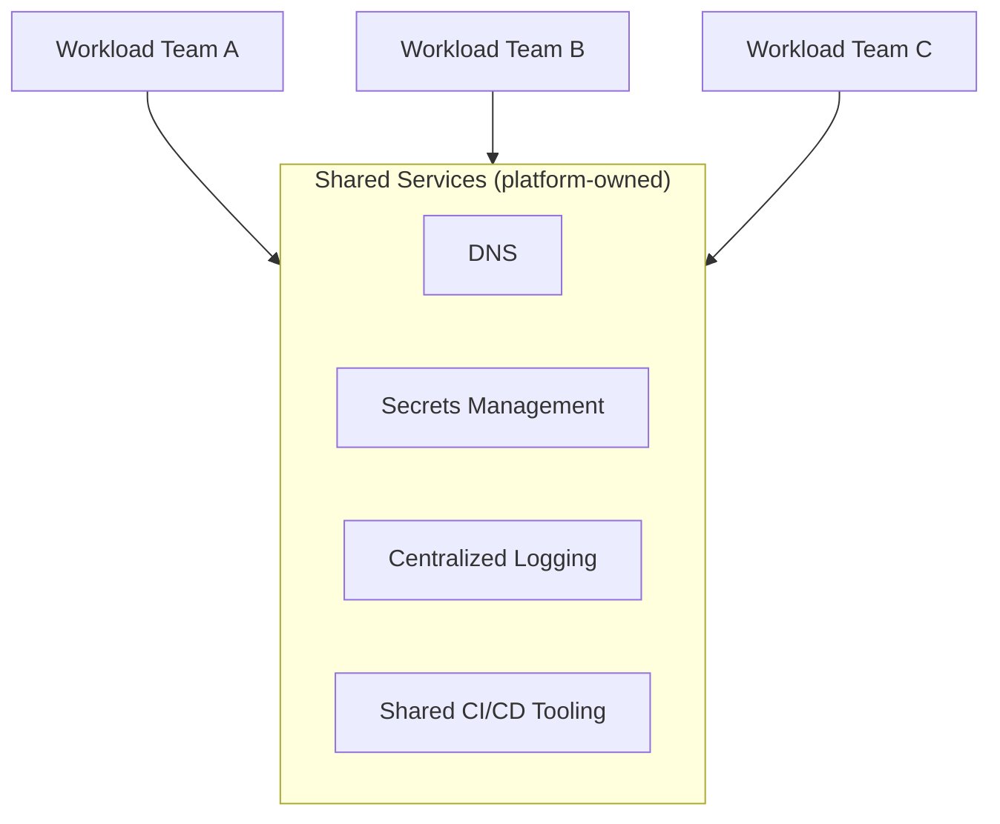

# Shared Services

## Overview

Shared services centralizes infrastructure capabilities used by every workload team — networking, DNS, secrets management, CI/CD tooling, logging — into a small number of platform-owned projects, rather than each team building its own. It's the organizational counterpart to hub-and-spoke's network centralization.

## Business Problem

Every team independently standing up its own DNS, secrets management, and logging pipeline duplicates effort, produces inconsistent security posture, and multiplies the surface area a security or compliance team needs to review.

## Architecture

## Design Decisions

- Shared services are provisioned in **dedicated, platform-owned projects** ("Common" folder in the companion `gcp-landing-zone` repository), never colocated with workload resources.
- Each shared service exposes a **self-service interface** (an API, a Terraform module, a golden-path template) rather than requiring a ticket to the platform team for routine use.

## Decision Trade-offs

| Choice | Trade-off |
|---|---|
| Centralized shared services | Consistent security/operational posture, lower aggregate cost; platform team becomes a dependency for shared capabilities |
| Per-team duplication | Full team autonomy; inconsistent posture and duplicated cost/effort across the organization |

## Advantages

- Reduces duplicated infrastructure effort and cost across teams
- Centralizes the highest-value security controls (secrets management, logging) where they're easiest to review and audit
- Frees workload teams to focus on their actual product rather than infrastructure plumbing

## Disadvantages

- Creates a genuine platform-team dependency — an outage or bottleneck in shared services has broad blast radius
- Requires the platform team to build real self-service tooling, or shared services becomes exactly the request-queue bottleneck it exists to avoid

## Security Considerations

Centralizing secrets management and logging (see `architecture-domains/security.md`, `architecture-domains/observability.md`) is one of the highest-leverage security investments an organization can make — it turns "every team configures Key Vault/Secret Manager access correctly" into "the platform team configures it correctly once."

## Operational Considerations

Shared services need Tier-0 operational rigor (redundancy, on-call, SLOs) proportional to how many teams depend on them — see `architecture-domains/observability.md` for SRE practices applicable here.

## Cost Considerations

Centralization typically reduces aggregate cost (one logging pipeline instead of a dozen), but the shared services budget needs to be owned and tracked centrally rather than invisibly distributed across workload team budgets.

## Scalability

Shared services scale well as long as the self-service interface keeps pace with team growth — the moment self-service lags behind demand, the platform team becomes a bottleneck that scales linearly with team count instead of sublinearly.

## Availability

Shared services availability requirements should generally exceed any individual workload's requirements, since an outage affects every dependent team simultaneously — see `architecture-domains/disaster-recovery.md`.

## Real Enterprise Scenario

A healthcare company centralized secrets management into a single Key Vault-per-environment pattern after discovering during a security audit that six different teams had six different (and in two cases, badly misconfigured) approaches to storing database credentials. Centralization plus a self-service Terraform module cut the audit finding count to zero within one quarter.

## Common Mistakes

- Centralizing a service without building genuine self-service access, recreating a ticket queue under a different name.
- Under-provisioning shared services' redundancy relative to their organization-wide blast radius.
- Centralizing workload-specific concerns (not just genuinely shared ones) into the shared services layer, overloading it.

## Interview Questions

- "What belongs in shared services versus what belongs in a team's own workload project?"
- "How do you prevent a shared services team from becoming a bottleneck?"
- "How would you design shared services' own disaster recovery, given its organization-wide blast radius?"

## Summary

Shared services centralizes genuinely common infrastructure capabilities — networking, DNS, secrets, logging, CI/CD tooling — into platform-owned, self-service-accessible projects, reducing duplication and improving consistency at the cost of creating a critical, must-be-highly-available platform dependency.

## Further Reading

- `cloud-patterns/landing-zone.md`, `cloud-patterns/hub-spoke.md`
- `architecture-domains/observability.md`, `architecture-domains/security.md`
