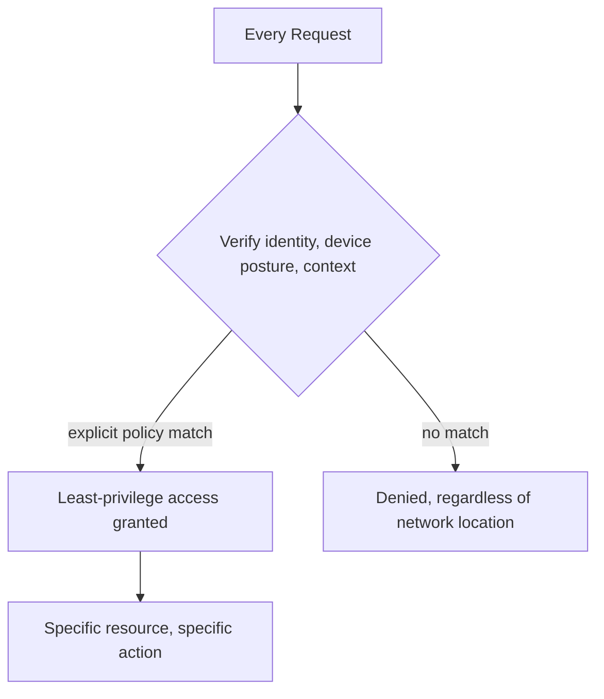

# Zero Trust Architecture

## Overview

Zero Trust replaces network-location-based trust ("you're on the internal network, therefore you're trusted") with identity-based, continuously verified trust for every request, regardless of where it originates. It's less a single technology and more an architectural stance that reshapes networking, identity, and access decisions across the board.

## Business Problem

Perimeter-based security ("hard shell, soft interior") fails badly once an attacker gets past the perimeter — via a phished credential, a compromised third-party integration, or a misconfigured public-facing resource — because internal traffic is implicitly trusted with little further verification. Zero Trust assumes the perimeter will eventually be breached and designs accordingly.

## Architecture

## Design Decisions

- Trust is evaluated **per request**, using identity and context (device posture, location, time), not granted implicitly by network location — being "inside the VPC" grants nothing on its own.
- **Least privilege by default** — access is scoped to the minimum needed for a specific task, mirroring the group-based, custom-role IAM model in the companion `gcp-landing-zone` repository's `docs/07-iam-security.md`.
- Micro-segmentation (fine-grained network policy, not just perimeter firewalls) is applied so that even a compromised workload has minimal lateral movement options — see `architecture-domains/networking.md`.

## Decision Trade-offs

| Choice | Trade-off |
|---|---|
| Zero Trust over perimeter-based trust | Much stronger posture against lateral movement and credential compromise; substantially more upfront design and ongoing policy management effort |
| Continuous verification | Better security; adds latency/complexity to every request path versus a one-time perimeter check |

## Advantages

- Dramatically limits blast radius when (not if) a credential or workload is compromised
- Removes the false security of "internal network" as an implicit trust signal
- Composes naturally with modern identity providers, service mesh mTLS, and hierarchical firewall policy already covered elsewhere in this repository

## Disadvantages

- Significant upfront design and ongoing policy-maintenance effort — Zero Trust is not a product you buy, it's an architecture you build and continuously tune
- Can meaningfully slow down legitimate work if policies are too coarse or too aggressively restrictive, driving workarounds that undermine the model
- Retrofitting Zero Trust onto an existing perimeter-based estate is a substantial, multi-year undertaking for a large organization

## Security Considerations

This entire document is a security pattern; the key summary is that Zero Trust shifts the trust boundary from network location to verified identity plus context, evaluated continuously rather than once at the perimeter.

## Operational Considerations

Zero Trust policy needs to be manageable at scale — hand-crafted, per-resource policy doesn't scale past a modest number of services; this argues for policy-as-code and centrally managed, group-based access models (see the companion `terraform-enterprise` repository's `docs/08-policy-as-code.md`).

## Cost Considerations

Zero Trust tooling (identity-aware proxies, service mesh, fine-grained policy engines) has real licensing/operational cost, but is frequently justified by the cost of the incidents it prevents — this trade-off is hard to quantify precisely and is often a risk-tolerance conversation rather than a pure ROI calculation.

## Scalability

Zero Trust policy models scale well when built on group-based identity and automated policy enforcement from the start; retrofitting scale onto a hand-managed policy set is where most organizations struggle.

## Availability

Zero Trust's continuous verification introduces a new availability dependency — identity providers and policy engines must themselves be highly available, since their failure can block legitimate access entirely (fail-closed) unless carefully designed fallback behavior is in place.

## Real Enterprise Scenario

A financial services company's Zero Trust adoption began not with a network redesign but with identity — moving from broad, standing VPN access to identity-aware, per-application access requests with device posture checks. The network segmentation work followed over the subsequent 18 months, reflecting a common, pragmatic adoption sequence: identity first, network segmentation second.

## Common Mistakes

- Treating Zero Trust as a single product purchase rather than an ongoing architectural practice.
- Over-restricting policy on day one, driving frustrated users toward insecure workarounds (shared credentials, disabled MFA "temporarily").
- Neglecting device posture and context signals, reducing Zero Trust to "just better network segmentation" without the identity-context depth that makes it effective.

## Interview Questions

- "How does Zero Trust change your approach to network segmentation?"
- "What's a practical first step for an organization starting a Zero Trust adoption?"
- "How do you avoid Zero Trust policy becoming unmanageable at scale?"

## Summary

Zero Trust replaces implicit, network-location-based trust with continuous, identity-and-context-based verification for every request, dramatically limiting lateral movement after a compromise at the cost of significant upfront and ongoing policy design effort.

## Further Reading

- `cloud-patterns/hybrid-cloud.md`, `cloud-patterns/mesh-network.md`
- `architecture-domains/identity.md`, `architecture-domains/security.md`
- `diagrams/zero-trust.drawio`
