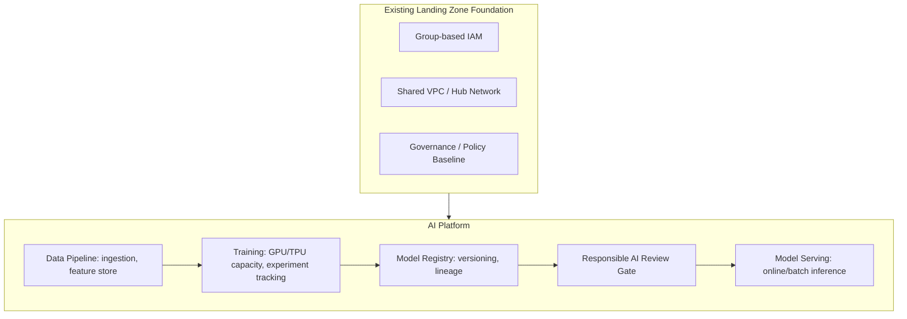

# Reference Architecture: Enterprise AI Platform

## Overview

An enterprise AI/ML platform architecture built on top of the landing zone foundation — covering model training, model serving, data pipelines, and the governance layer specific to AI workloads (data lineage, model versioning, responsible-AI review) that general-purpose landing zones don't address.

## Business Problem

AI/ML workloads have distinct infrastructure requirements (GPU/TPU capacity, large-scale data pipelines, model versioning and rollback) and distinct governance requirements (data lineage for training data, bias/fairness review, model explainability for regulated use cases) that a generic application landing zone doesn't cover — but the AI platform still needs to inherit the landing zone's security and identity foundation, not reinvent it.

## Architecture

## Design Decisions

- **The AI platform is built on the existing landing zone, not alongside it** — AI workload projects are ordinary service projects attached to the Shared VPC, with the same group-based IAM model, gaining GPU/TPU-specific compute and data-pipeline services as an addition, not a parallel, separately-governed platform.
- **A model registry with mandatory versioning and lineage tracking** sits between training and serving — no model reaches a serving endpoint without a registry entry documenting its training data lineage and evaluation metrics.
- **A responsible-AI review gate** (bias/fairness evaluation, explainability requirements for regulated use cases) is a required step before serving, proportional to the use case's risk — a low-stakes internal tool has lighter review than a customer-facing credit decision model.

## Decision Trade-offs

| Choice | Trade-off |
|---|---|
| AI platform built on existing landing zone | Inherits proven security/governance foundation, faster to stand up; some AI-specific infrastructure (GPU quota, specialized networking for distributed training) needs landing-zone-aware extension work |
| Mandatory model registry + lineage | Strong governance and reproducibility; adds process overhead to every model's path to production |
| Risk-proportional responsible-AI review | Avoids blanket over-review of low-stakes models; requires a genuine, maintained risk classification framework to work well |

## Advantages

- AI workloads inherit the landing zone's security and IAM model automatically, avoiding a parallel, inconsistent governance track
- Model lineage and versioning make incident response (a model behaving unexpectedly) and compliance audits tractable
- Risk-proportional review avoids both under-governing high-stakes models and over-governing low-stakes ones

## Disadvantages

- GPU/TPU capacity planning and quota management is a genuinely new operational skill for a platform team without prior ML infrastructure experience
- Responsible-AI review requires cross-functional collaboration (legal, ethics, domain experts) that's organizationally harder to establish than a purely technical review gate
- Data pipelines feeding training often need to reach across more of the organization's data estate than typical application workloads, testing the landing zone's data governance boundaries

## Security Considerations

Training data frequently includes sensitive or regulated data — the same data classification and access control principles from `architecture-domains/storage.md` and `architecture-domains/security.md` apply, with the added consideration that a trained model can itself leak information about its training data, which changes what "protecting the data" means.

## Operational Considerations

Model serving endpoints need the same observability rigor as any other production service (`architecture-domains/observability.md`), plus model-specific monitoring (prediction drift, data drift) that generic infrastructure monitoring doesn't cover.

## Cost Considerations

GPU/TPU capacity is typically the dominant cost driver in an AI platform, and training job scheduling/right-sizing (matching job requirements to actual hardware needed, using spot/preemptible capacity where tolerable) is the highest-leverage cost control — see `architecture-domains/compute.md`.

## Scalability

Feature stores and model registries need to scale with both the number of models and the training data volume — a design that works for a handful of models frequently doesn't scale cleanly to dozens without revisiting the registry and pipeline architecture.

## Availability

Model serving availability requirements vary enormously by use case — a real-time fraud-detection model has very different availability needs than a nightly batch recommendation job — and should be set explicitly per model, consistent with the RTO/RPO-driven reasoning in `architecture-domains/disaster-recovery.md`.

## Real Enterprise Scenario

See `case-studies/ai-cloud-adoption.md` for a complete narrative of an enterprise's AI platform build-out, including how their existing landing zone's IAM and network foundation accelerated the platform build versus starting from scratch, and where they had to genuinely extend it (GPU quota management, a new responsible-AI review process).

## Common Mistakes

- Building a separate, parallel AI platform with its own IAM and network model instead of extending the existing landing zone, creating governance inconsistency.
- No model registry or lineage tracking, making it impossible to answer "what data trained the model currently in production" during an incident or audit.
- Applying uniform, heavy responsible-AI review to every model regardless of actual risk, slowing down low-stakes work without a corresponding governance benefit.

## Interview Questions

- "How would you extend an existing landing zone to support an AI/ML platform?"
- "What belongs in a model registry, and why does lineage tracking matter?"
- "How would you design a risk-proportional responsible-AI review process?"

## Summary

An enterprise AI platform extends the existing landing zone's security and governance foundation with AI-specific capabilities — GPU/TPU capacity, data pipelines, a model registry with lineage tracking, and a risk-proportional responsible-AI review gate — rather than standing up a separately governed parallel platform.

## Further Reading

- `architecture-domains/compute.md`, `architecture-domains/storage.md`, `architecture-domains/observability.md`
- `case-studies/ai-cloud-adoption.md`
- `diagrams/ai-platform.drawio`
