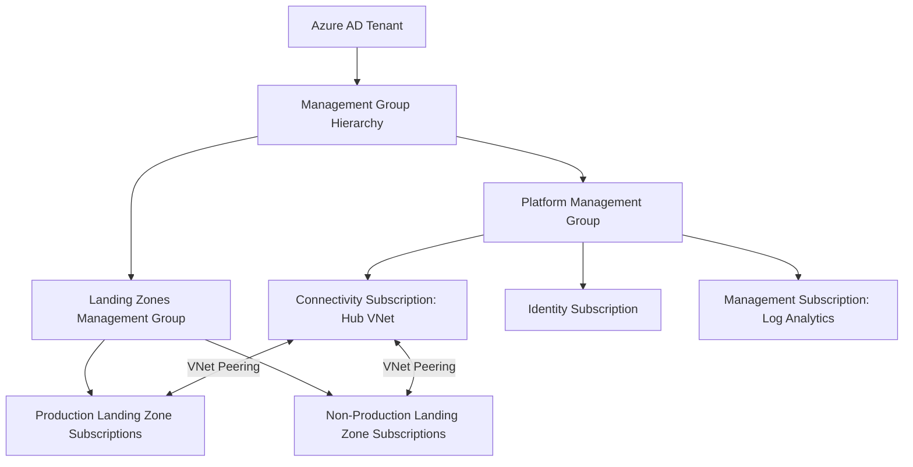

# Reference Architecture: Enterprise Azure Foundation

## Overview

A complete enterprise Azure foundation composing management group hierarchy, hub-and-spoke networking, centralized identity via Azure AD/Entra ID, and policy-driven governance — the Azure-specific expression of the landing zone pattern (`cloud-patterns/landing-zone.md`).

## Business Problem

An enterprise adopting Azure needs a foundation that many subscriptions and teams can build on consistently, without each subscription independently reinventing networking, identity, and governance.

## Architecture

## Design Decisions

- **Management groups mirror the environment-first structure** used in this repository's GCP counterpart (see ADR-001), with Platform and Landing Zones as the top two management groups, and Production/Non-Production nested under Landing Zones.
- **Hub VNet in a dedicated Connectivity subscription**, with landing zone subscriptions peered to it — the Azure expression of hub-and-spoke (`cloud-patterns/hub-spoke.md`).
- **Azure Policy assigned at the management group level**, inherited down, mirroring the Org Policy inheritance model described in `architecture-domains/governance.md`.
- **Centralized Log Analytics workspace** in the Management subscription, with diagnostic settings on every resource forwarding to it by policy — not opt-in per subscription.

## Decision Trade-offs

| Choice | Trade-off |
|---|---|
| Management-group-level policy inheritance | Consistent enforcement without per-subscription setup; requires careful management group design since it's harder to restructure later than a subscription |
| Hub VNet peering over Azure Virtual WAN | Simpler, well-understood model for a moderate number of spokes; Virtual WAN's managed hub-of-hubs would scale further but with more platform complexity than this scale currently justifies |

## Advantages

- Every new landing zone subscription inherits network connectivity, policy, and logging automatically upon creation
- Management group-based policy assignment gives a single, auditable enforcement point for the whole tenant
- Consistent with the same architectural reasoning as the GCP reference architecture, easing any future multi-cloud governance conversation

## Disadvantages

- Management group restructuring is disruptive once subscriptions are attached — this decision carries the same "expensive to reverse" weight as the GCP folder hierarchy (ADR-001)
- Hub VNet remains a bottleneck/dependency for every spoke, per the trade-offs described in `cloud-patterns/hub-spoke.md`

## Security Considerations

Azure Policy's `deny` effect for constraints like disallowed public IPs or unencrypted storage should be applied at the management group level so every landing zone subscription inherits the restriction without per-subscription configuration — consistent with `architecture-domains/security.md`'s preference for structural over procedural controls.

## Operational Considerations

The Connectivity, Identity, and Management subscriptions should be operated with Tier-0 rigor (change review, redundancy) since every landing zone subscription depends on them — see `cloud-patterns/shared-services.md`.

## Cost Considerations

Centralizing Log Analytics ingestion reduces duplicated logging infrastructure cost, but ingestion volume should be actively monitored — a common source of unexpected Log Analytics cost growth as more resources are onboarded.

## Scalability

This structure scales to dozens of landing zone subscriptions without redesign; very large enterprises (hundreds of subscriptions) often introduce Azure Virtual WAN for hub connectivity at that scale, per the trade-off noted above.

## Availability

Hub VNet and shared identity/connectivity resources should be deployed with zone-redundant configurations where available — a single-zone hub failure would affect every peered landing zone subscription.

## Real Enterprise Scenario

A financial services company migrating from a single flat subscription model to this management-group-based structure took roughly one quarter to plan the management group hierarchy and Azure Policy assignments, then completed subscription migration incrementally over the following two quarters — front-loading the structural decisions (per ADR-001's reasoning) before moving workloads.

## Common Mistakes

- Assigning Azure Policy at the subscription level instead of the management group level, requiring redundant per-subscription configuration.
- Under-provisioning hub VNet redundancy, creating a single point of failure for every landing zone.
- Treating the management group hierarchy as easily changeable and designing it hastily, then facing a disruptive restructuring once dozens of subscriptions are attached.

## Interview Questions

- "How would you structure Azure management groups for a multi-business-unit enterprise?"
- "How does Azure Policy inheritance compare to GCP Organization Policy inheritance?"
- "When would you introduce Azure Virtual WAN instead of a simple hub VNet?"

## Summary

This Azure enterprise reference architecture mirrors the same environment-first, policy-inheritance, hub-and-spoke reasoning as this repository's GCP reference architecture, expressed through Azure-native constructs: management groups, Azure Policy, and hub VNet peering.

## Further Reading

- `cloud-patterns/landing-zone.md`, `cloud-patterns/hub-spoke.md`
- `architecture-decision-records/adr-001-landing-zone.md`, `adr-002-network-design.md`
- `reference-architectures/gcp-enterprise.md`
