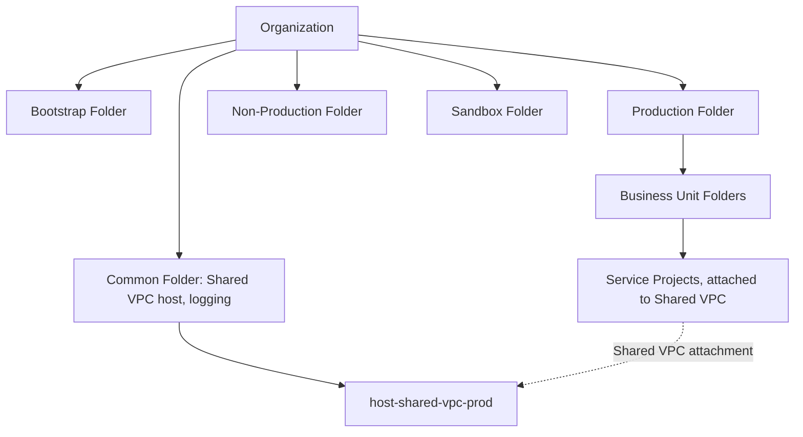

# Reference Architecture: Enterprise GCP Foundation

## Overview

A complete enterprise GCP foundation composing an environment-first folder hierarchy, Shared VPC networking, group-based IAM, and org-level governance — the concrete, fully implemented version of this pattern lives in the companion `gcp-landing-zone` repository; this document is the architectural narrative behind it.

## Business Problem

Identical to `reference-architectures/azure-enterprise.md`'s framing: an enterprise adopting GCP needs a foundation that scales across many teams and projects consistently, without ungoverned, ad hoc project sprawl.

## Architecture

## Design Decisions

- **Environment-first folder hierarchy** — see ADR-001 for the full reasoning.
- **Shared VPC per environment**, not per business unit — see ADR-002.
- **Group-based IAM exclusively** — see ADR-003.
- **Policy-as-code enforcement in CI** — see ADR-005.
- **Project factory pattern** — every project created through a structured Terraform map (folder, billing, APIs, labels), not manually in the console, ensuring naming and baseline configuration consistency.

## Decision Trade-offs

See ADR-001 through ADR-005 for the detailed trade-off analysis behind each structural decision; this reference architecture is their composition.

## Advantages

- Every new project inherits network, IAM baseline, and governance automatically via folder placement and the project factory
- Centralized Shared VPC eliminates per-team networking duplication
- Group-based IAM and policy-as-code make access review and compliance auditing tractable at scale

## Disadvantages

- Requires genuine upfront platform investment before workload teams see value — consistent with the landing-zone-first sequencing in `architecture-principles/cloud-adoption-framework.md`
- Folder hierarchy and Shared VPC host project IAM are both high-consequence, hard-to-reverse decisions requiring careful upfront design

## Security Considerations

Org Policy baseline (disable service account key creation, deny external IPs by default, restrict resource locations) is set at the organization node so every project inherits it — see `architecture-domains/security.md` and `architecture-domains/governance.md`.

## Operational Considerations

The Common folder's shared infrastructure (Shared VPC host, logging-hub) requires Tier-0 operational rigor since every workload project depends on it — see `cloud-patterns/shared-services.md`.

## Cost Considerations

Budget-as-guardrail is applied at project creation via the project factory, with alert thresholds at 50/80/100% — see `architecture-domains/governance.md`.

## Scalability

This structure has been validated (in the companion repository's narrative) to scale from a handful of workload teams to dozens of business units and hundreds of projects without structural redesign.

## Availability

Shared VPC host project networking (Cloud NAT, Cloud Router) is deployed multi-zone/multi-region as workload requirements demand — see `architecture-domains/networking.md`.

## Real Enterprise Scenario

See `case-studies/landing-zone-implementation.md` for a complete narrative of this reference architecture's real-world-modeled build-out, including the organizational negotiation required to migrate existing, ungoverned workloads onto it.

## Common Mistakes

See the Common Mistakes sections of ADR-001 through ADR-005 and `cloud-patterns/landing-zone.md` — this reference architecture's failure modes are the composition of its component decisions' individual failure modes.

## Interview Questions

- "Walk me through how you'd design a GCP landing zone from scratch for a new enterprise customer."
- "How does this folder/Shared VPC/IAM design change for an organization expecting significant growth through acquisition?"
- "What would you do differently if the organization had much stricter data residency requirements?"

## Summary

This GCP enterprise reference architecture composes the environment-first folder hierarchy, Shared VPC networking, group-based IAM, and policy-as-code governance detailed in ADR-001 through ADR-005, providing a concrete implementation in the companion `gcp-landing-zone` repository.

## Further Reading

- Companion repository: `gcp-landing-zone` (complete Terraform implementation)
- `architecture-decision-records/adr-001` through `adr-005`
- `reference-architectures/azure-enterprise.md`
