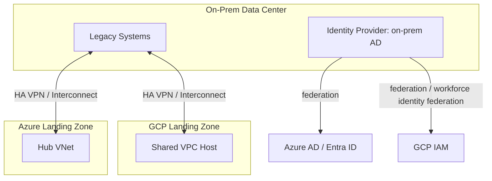

# Reference Architecture: Hybrid Cloud

## Overview

A complete hybrid architecture connecting an on-premises data center to both Azure and GCP landing zones, with federated identity and staged connectivity — the composed, cross-cloud expression of `cloud-patterns/hybrid-cloud.md`.

## Business Problem

Organizations with existing on-prem investments, regulatory constraints, or multi-year migration timelines need connectivity and governance spanning on-prem and one or more clouds as a first-class, long-term architecture — not a temporary bridge to be tolerated until migration completes.

## Architecture

## Design Decisions

- **A single on-prem identity source federates to both clouds** rather than maintaining separate identity stores per cloud — consistent with `architecture-domains/identity.md`.
- **Staged connectivity**: HA VPN to both clouds initially, with Dedicated/Partner Interconnect introduced to whichever cloud carries the larger sustained bandwidth requirement, decided by actual measured traffic rather than upfront guess.
- **Non-overlapping IP address space across on-prem, Azure, and GCP**, planned centrally before any connectivity is built — the single most important, hardest-to-reverse decision in this architecture.

## Decision Trade-offs

| Choice | Trade-off |
|---|---|
| Federated single identity source | Consistent access model and offboarding across all three environments; on-prem identity infrastructure becomes critical-path for cloud access too |
| Staged connectivity (VPN first) | Fast initial time-to-connectivity for both clouds; requires revisiting once real traffic patterns emerge |

## Advantages

- Unified identity and governance model across on-prem and both clouds, avoiding fragmented access review
- Staged connectivity avoids premature Interconnect investment before actual bandwidth needs are known
- Central IP planning avoids the costly renumbering scenario described in `architecture-domains/networking.md`'s real enterprise scenario

## Disadvantages

- Operating three environments (on-prem, Azure, GCP) simultaneously is genuinely more complex than a single-cloud or even simple hybrid architecture
- Federating identity across three environments is real, non-trivial integration work
- IP planning across three separately-administered environments requires strong cross-team coordination discipline

## Security Considerations

Traffic arriving from on-prem over VPN/Interconnect into either cloud should not be implicitly trusted as "internal" — Zero Trust principles (`cloud-patterns/zero-trust.md`) apply equally to hybrid connectivity paths.

## Operational Considerations

A genuinely hybrid, three-environment architecture benefits enormously from consistent observability tooling spanning all three — see `architecture-domains/observability.md` — since fragmented, environment-specific tooling makes cross-environment incident investigation dramatically slower.

## Cost Considerations

Running connectivity to two clouds roughly doubles hybrid connectivity infrastructure cost versus a single-cloud hybrid architecture — this should be a deliberate decision justified by genuine multi-cloud business requirements, not accumulated accidentally through unrelated per-team cloud choices.

## Scalability

This architecture scales by adding connectivity capacity and extending the landing zone pattern (already present in both the Azure and GCP reference architectures) rather than requiring new structural patterns.

## Availability

Redundant connectivity (multiple tunnels/circuits) to each cloud is essential given the number of dependent workloads — see `cloud-patterns/hybrid-cloud.md`.

## Real Enterprise Scenario

A manufacturing company (see `case-studies/hybrid-cloud-strategy.md`) maintained genuinely permanent hybrid connectivity to both Azure (for their modernized ERP) and GCP (for their new data analytics platform), having federated identity from their existing on-prem Active Directory to both — a deliberate multi-cloud hybrid decision driven by each cloud's genuine best fit for a specific workload class, not accidental sprawl.

## Common Mistakes

- Building hybrid connectivity to a second cloud without a genuine business driver, simply because a team happened to prefer a different provider.
- Failing to federate identity consistently, leaving on-prem and cloud access reviews disconnected.
- Allowing IP ranges to overlap between on-prem, Azure, and GCP due to insufficiently centralized planning across three separately-administered environments.

## Interview Questions

- "How would you approach identity federation across on-prem and two public clouds?"
- "What would justify genuine multi-cloud hybrid connectivity versus consolidating on one cloud?"
- "How do you plan non-overlapping IP address space across three environments?"

## Summary

This hybrid cloud reference architecture connects on-prem to both Azure and GCP landing zones through federated identity, staged connectivity, and centrally planned IP address space — justified by genuine per-workload cloud fit rather than accidental multi-cloud sprawl.

## Further Reading

- `cloud-patterns/hybrid-cloud.md`, `cloud-patterns/zero-trust.md`
- `case-studies/hybrid-cloud-strategy.md`
- `diagrams/hybrid-cloud.drawio`
