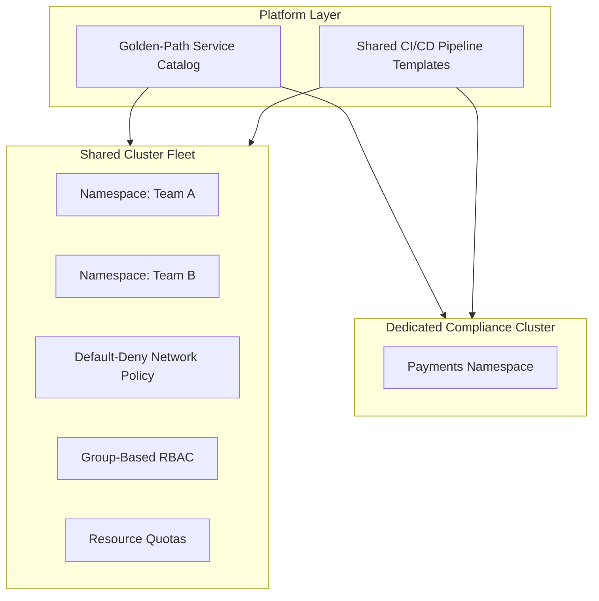

# Reference Architecture: Multi-Tenant Kubernetes Platform

## Overview

A complete Kubernetes platform composing the multi-tenancy model from `architecture-domains/kubernetes.md`, the golden-path service catalog from `architecture-domains/platform-engineering.md`, and the landing zone's network and identity foundation into a coherent, self-service platform for application teams.

## Business Problem

Application teams need to deploy and operate services on Kubernetes without each team independently solving cluster access, RBAC, networking policy, and CI/CD integration — while the platform team needs confidence that what's deployed is consistent, secure, and auditable.

## Architecture

## Design Decisions

- **Namespace-based multi-tenancy for general workloads, dedicated cluster for compliance-scoped workloads** — see ADR-004 for the full reasoning.
- **A golden-path service catalog** (Helm charts/manifests with CI/CD, observability, and network policy pre-wired) is the primary developer interface, not raw `kubectl apply` against hand-written manifests.
- **Group-based RBAC and default-deny network policy** — consistent with `architecture-domains/identity.md` and `architecture-domains/networking.md` applied at the Kubernetes layer.

## Decision Trade-offs

See `architecture-decision-records/adr-004-kubernetes.md` for the primary namespace-vs-dedicated-cluster trade-off; this reference architecture additionally trades golden-path opinionation against team flexibility, per `architecture-principles/platform-engineering.md`.

## Advantages

- Application teams get a fast, safe path to production without needing deep Kubernetes expertise on every team
- Consistent security posture (RBAC, network policy, resource quotas) across every tenant by default
- Compliance-scoped workloads get appropriate isolation without over-isolating everything else

## Disadvantages

- Golden-path catalog requires ongoing platform investment to stay current with evolving best practices and team needs
- Operating both a shared fleet and a dedicated compliance cluster is genuinely more operational surface area than either alone
- Teams with genuinely unusual requirements may find the golden path too opinionated, requiring an escape-hatch process

## Security Considerations

RBAC and network policy are necessary but not sufficient defense in depth — see `cloud-patterns/mesh-network.md` for how a service mesh's mTLS adds identity-based security network policy alone doesn't provide.

## Operational Considerations

Cluster upgrades, node pool management, and golden-path template maintenance are platform-team-owned with their own on-call rigor — see `architecture-domains/platform-engineering.md`.

## Cost Considerations

Shared-cluster bin-packing generally achieves better utilization than per-team dedicated infrastructure, but requires accurate per-namespace cost attribution via resource quotas and labels — see `architecture-domains/kubernetes.md`.

## Scalability

This platform model scales to dozens of tenant teams on the shared fleet; further compliance-driven cluster segmentation is added incrementally as new regulated workload classes emerge, following the same reasoning as ADR-004.

## Availability

Multi-zone node pools and properly configured pod disruption budgets protect every tenant on the shared fleet simultaneously — see `architecture-domains/disaster-recovery.md`.

## Real Enterprise Scenario

See `case-studies/kubernetes-adoption.md` for the complete narrative of this platform's adoption curve — including the golden-path catalog's slow initial adoption until the platform team added dedicated onboarding support, a pattern consistent with `architecture-principles/platform-engineering.md`'s emphasis on product-thinking over pure technical capability.

## Common Mistakes

See the Common Mistakes sections of `architecture-domains/kubernetes.md` and `architecture-domains/platform-engineering.md` — this reference architecture's failure modes are the composition of both domains' individual failure modes.

## Interview Questions

- "How would you design the first three templates in a Kubernetes golden-path catalog?"
- "Walk me through your multi-tenancy isolation model and when you'd deviate from it."
- "How do you measure whether your Kubernetes platform is actually reducing team toil?"

## Summary

This Kubernetes platform reference architecture composes namespace-based multi-tenancy (with dedicated clusters for compliance-scoped workloads), a golden-path service catalog, and group-based RBAC/network policy into a coherent, self-service platform built on the existing landing zone's identity and network foundation.

## Further Reading

- `architecture-domains/kubernetes.md`, `architecture-domains/platform-engineering.md`
- `architecture-decision-records/adr-004-kubernetes.md`
- `case-studies/kubernetes-adoption.md`
- `diagrams/kubernetes.drawio`
