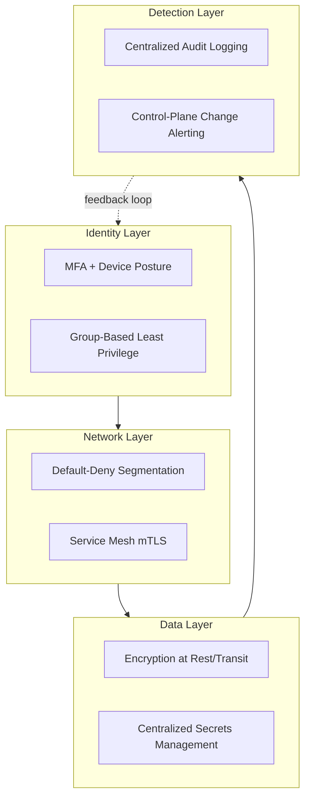

# Reference Architecture: Secure Enterprise (Zero Trust, Defense in Depth)

## Overview

A composed reference architecture demonstrating how Zero Trust principles (`cloud-patterns/zero-trust.md`) and defense-in-depth security (`architecture-domains/security.md`) apply across every other layer of the landing zone — the security-first lens applied to the same foundation described in `reference-architectures/azure-enterprise.md` and `gcp-enterprise.md`.

## Business Problem

Security is frequently treated as a layer bolted onto an architecture after the fact, rather than a lens applied to every architectural decision from the start — this reference architecture demonstrates the latter approach concretely, across identity, network, compute, and data.

## Architecture

## Design Decisions

- **Every request is verified by identity and context, never by network location alone** — the Zero Trust principle applied consistently across VPN/hybrid connectivity, internal service-to-service calls, and external access.
- **Secrets are referenced from a centralized secret store at runtime**, never passed as plain configuration — see the companion `terraform-enterprise` repository's `docs/09-security.md`.
- **Every control-plane change (IAM policy, org policy, firewall policy) triggers the highest-severity alert**, since these are leading indicators of both misconfiguration and active compromise — see `architecture-domains/observability.md`.
- **Policy-as-code enforcement in CI** (ADR-005) catches violations before they reach production, backstopped by cloud-native runtime policy (Org Policy/Azure Policy) for changes made outside the pipeline.

## Decision Trade-offs

Each individual decision's trade-offs are covered in its originating document (`cloud-patterns/zero-trust.md`, `architecture-domains/identity.md`, `architecture-domains/security.md`); this reference architecture's aggregate trade-off is meaningfully higher upfront design and ongoing operational effort in exchange for materially reduced blast radius when (not if) any single control fails.

## Advantages

- No single point of security failure — compromise of any one layer doesn't cascade into full compromise
- Consistent, auditable enforcement across identity, network, data, and detection
- Composes cleanly with both the Azure and GCP reference architectures without requiring a different security model per cloud

## Disadvantages

- Genuinely more expensive to build and operate than a perimeter-only security model — this is a deliberate trade-off, not a free upgrade
- Requires organizational security maturity (dedicated security engineering capacity, not just a compliance checklist) to implement and maintain well
- Can slow down legitimate work if policy is miscalibrated too strictly, driving the workaround behaviors described in `architecture-domains/security.md`

## Security Considerations

This entire document is a security reference architecture; its central thesis is that Zero Trust and defense in depth are not separate initiatives from the rest of the landing zone — they're the lens through which every other architectural decision in this repository should be evaluated.

## Operational Considerations

The detection layer's alerting needs a genuinely staffed, on-call response capability — alerts nobody responds to provide the appearance of security without the substance, and this gap is discovered only during an actual incident.

## Cost Considerations

Security tooling (service mesh, policy engines, centralized logging at scale) has real cost, generally justified against the cost of the incidents this architecture is designed to contain or prevent — a risk-tolerance conversation more than a pure ROI calculation, per `architecture-domains/security.md`.

## Scalability

Every component of this security architecture (group-based IAM, policy-as-code, centralized logging) is chosen specifically because it scales with organizational growth without proportional headcount growth in security review capacity.

## Availability

Security controls occasionally trade off directly against availability (aggressive lockout policies, fail-closed identity verification) — this reference architecture favors fail-closed for genuinely sensitive operations and fail-open with strong logging for lower-stakes ones, a calibration that should be made deliberately per control, not defaulted uniformly.

## Real Enterprise Scenario

A healthcare company's implementation of this composed security architecture reduced their mean time to detect a credential compromise from an estimated multiple days (under their prior, fragmented per-project logging model) to under two hours, once centralized audit logging and control-plane change alerting were in place — see the real enterprise scenario in `architecture-domains/security.md` for the fuller narrative.

## Common Mistakes

- Treating security as a separate track from the rest of the architecture instead of a lens applied to every decision.
- Deploying detection tooling without staffing the response capability to act on what it surfaces.
- Miscalibrating policy strictness uniformly instead of proportional to actual risk, driving workarounds that undermine the model.

## Interview Questions

- "How do Zero Trust and defense in depth relate to each other, in your framing?"
- "Walk me through how you'd calibrate fail-open versus fail-closed for different types of access control."
- "How do you measure whether a security architecture investment is actually reducing risk?"

## Summary

This secure enterprise reference architecture composes Zero Trust identity verification, default-deny network segmentation, centralized secrets and encryption, and control-plane-focused detection into a defense-in-depth model applied consistently across the rest of this repository's reference architectures, not as a separate security track.

## Further Reading

- `cloud-patterns/zero-trust.md`, `architecture-domains/security.md`, `architecture-domains/identity.md`
- `architecture-decision-records/adr-005-security.md`
- `diagrams/zero-trust.drawio`
